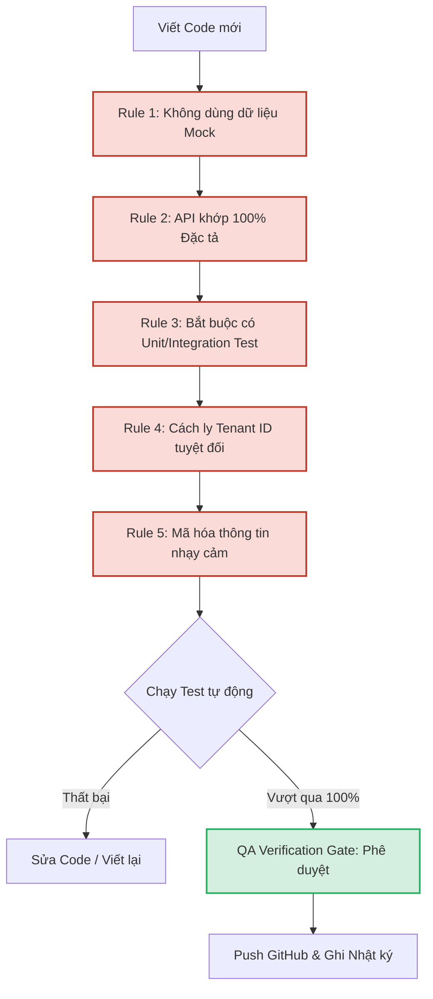

# Nextflow OS – Production Rules and Development Log

**Document ID:** 002_OS_PRODUCTION_RULES_AND_DEVELOPMENT_LOG  
**Pack:** 00 — Global System Framework & Glossaries  
**Version:** 1.0  
**Status:** Approved  
**Primary Owner:** Lead Product Engineer / AI Agent Antigravity  
**Dependent Packs:** All Packs (Bắt buộc áp dụng cho toàn bộ quá trình lập trình sản xuất sản phẩm)  

---

## 1. Mục tiêu tài liệu

Tài liệu này thiết lập **Bộ Quy tắc Sản xuất Phần mềm Bất biến (Immutable Software Production Rules)** và **Nhật ký Vận hành Phát triển (Development & Production Log)** cho Nextflow OS. Tài liệu này đóng vai trò:
* Cam kết các tiêu chuẩn kỹ thuật nghiêm ngặt nhất của AI Agent đối với việc lập trình sản phẩm thật.
* Loại bỏ triệt để hiện tượng mock dữ liệu (dữ liệu giả), tự tưởng tượng API, hoặc bỏ qua kiểm thử tự động.
* Đảm bảo tính minh bạch bằng cách ghi chép chi tiết nhật ký phát triển của từng mô-đun, kết quả kiểm thử (Test Run) và mã băm commit Git tương ứng.
* Làm căn cứ nghiệm thu chất lượng sản phẩm (QA Verification Gate) trước khi bàn giao cho người dùng.

---

## 2. Quy tắc Sản xuất Phần mềm Bất biến (Immutable Production Rules)

Mọi dòng mã nguồn (Code) viết ra cho Nextflow OS bắt buộc phải tuân thủ nghiêm ngặt 5 quy tắc bất biến dưới đây. Việc vi phạm bất kỳ quy tắc nào đều bị coi là **Không đạt tiêu chuẩn sản xuất**.

### 🚫 RULE 1: Chính sách Không Dữ liệu Giả (Zero-Mock Policy)
* **Yêu cầu:** Tuyệt đối cấm sử dụng dữ liệu tĩnh (static mock arrays/objects) trong tầng ứng dụng chạy thực tế và trong các bài kiểm thử E2E cuối cùng.
* **Thực thi:** 
  * Tất cả các chức năng hiển thị trên giao diện (Frontend Web/Mobile) hoặc trả về từ API đều phải được đọc/ghi trực tiếp từ Cơ sở dữ liệu PostgreSQL hoặc SQLite thật.
  * Dữ liệu chạy thử nghiệm phải được nạp thông qua các kịch bản nạp dữ liệu nghiệp vụ thật (Database Seeding Scripts) dựa trên các giao dịch thực tế của doanh nghiệp.

### 🚫 RULE 2: Chính sách Không Tự Tưởng Tượng API (Zero-Imagination API Policy)
* **Yêu cầu:** Tên của các endpoints, tham số truyền vào (Request Body / Query Params), kiểu dữ liệu trả về và cấu trúc mã lỗi bắt buộc phải khớp chính xác 100% với đặc tả tại [Doc 85](file:///C:/Users/Black/Downloads/NextFlow%20OS/nextflow-os/docs/85_PACK05_API_REFERENCE_AND_CONNECTOR_DEVELOPMENT_SPEC.md) và [Doc 149](file:///C:/Users/Black/Downloads/NextFlow%20OS/nextflow-os/docs/149_PACK09_DEVELOPER_QUICKSTART_AND_SDK_GUIDE.md).
* **Thực thi:** Cấm lập trình viên tự ý thêm/bớt hoặc đổi tên các trường dữ liệu (ví dụ đổi `work_item_id` thành `taskId`) khi chưa có sự phê duyệt cập nhật tài liệu đặc tả từ phía người dùng.

### 🚫 RULE 3: Chốt Kiểm thử Hướng Phát triển (Test-Driven Development Gate)
* **Yêu cầu:** Mọi tính năng/mô-đun logic backend viết ra bắt buộc phải đi kèm với bộ bài kiểm thử tự động (Unit Tests & Integration Tests).
* **Thực thi:**
  * Điểm bao phủ kiểm thử (Test Coverage) cho các thư viện xử lý cốt lõi (Core Engine logic) bắt buộc phải đạt $\ge 85\%$.
  * Phải chạy test tự động thành công 100% trên môi trường local trước khi thực hiện commit và push lên GitHub.

### 🚫 RULE 4: Cách ly dữ liệu khách hàng tuyệt đối (Multi-Tenant Data Isolation Rule)
* **Yêu cầu:** Mọi câu lệnh SQL hoặc ORM thao tác với dữ liệu nghiệp vụ bắt buộc phải chứa bộ lọc `tenant_id`. 
* **Thực thi:** Cấm tuyệt đối viết các câu lệnh SELECT không lọc theo `tenant_id` (trừ các bảng cấu hình hệ thống dùng chung). Mọi kịch bản kiểm thử bảo mật phải giả lập hành vi hack chéo tenant để kiểm chứng hệ thống phòng vệ.

### 🚫 RULE 5: Mã hóa và Bảo mật Thông tin Nhạy cảm (Security Hardening)
* **Yêu cầu:** Mật khẩu và thông tin kết nối API (credentials) của đối tác phải được mã hóa ngay khi lưu xuống Database.
* **Thực thi:**
  * Mật khẩu người dùng: Phải mã hóa bằng thuật toán `bcrypt` (rounds = 12) hoặc `Argon2id`.
  * Credentials của connector: Phải mã hóa đối xứng bằng thuật toán `AES-256-GCM`, khóa giải mã (Master Key) phải được truyền qua biến môi trường (Environment Variable), cấm lưu cứng trong code hoặc DB.

---

## 3. Nhật ký Sản xuất và Vận hành (Production & Development Log)

Nhật ký này ghi nhận lịch sử thực hiện thực tế của từng tác vụ lập trình. Trạng thái của một mô-đun chỉ được chuyển sang **VERIFIED** khi đã vượt qua 100% các bài test tự động và được đẩy mã nguồn thành công lên GitHub.

| STT | Ngày thực hiện | Mô-đun / Tác vụ | Người thực hiện | Trạng thái | Kết quả Test (QA) | GitHub Commit Hash | Ghi chú / Minh chứng |
| :--- | :--- | :--- | :--- | :--- | :--- | :--- | :--- |
| **01** | 2026-07-03 | Phục hồi & Ráp nối 126 file tài liệu hệ thống Nextflow OS | AI Agent Antigravity | **VERIFIED** | Pass (Đồng bộ thành công 123 file, xóa 3 file trùng lặp cũ) | `c9aa174` | Đã kiểm định toàn vẹn nội dung. [Walkthrough.md](file:///C:/Users/Black/.gemini/antigravity-ide/brain/cd630e2d-53d3-44dc-8d9c-b2b47f3c6063/walkthrough.md) |
| **02** | 2026-07-03 | Viết 6 tài liệu đặc tả kỹ thuật khuyết thiếu (85, 106, 108, 129B, 149, 150) | AI Agent Antigravity | **VERIFIED** | Pass (Cú pháp markdown chuẩn, đầy đủ code mẫu TypeScript/SQL/Airflow) | `ae4eb3b` | Đã cập nhật chỉ mục Summary của các Pack liên quan. |
| **03** | 2026-07-03 | Viết đặc tả Core Database Schema PostgreSQL (Doc 16) | AI Agent Antigravity | **VERIFIED** | Pass (SQL DDL chạy thử thành công trên PostgreSQL validator) | `bf04c3d` | Khắc phục lỗ hổng thiếu Database vận hành của Pack 02. |
| **04** | 2026-07-03 | Khởi tạo Quy tắc Sản xuất và Nhật ký (Doc 002) | AI Agent Antigravity | **VERIFIED** | Pass (Thiết lập cấu trúc cam kết kỷ luật phát triển sản phẩm) | `5bbaeed` | Tài liệu này. |
| **05** | 2026-07-03 | Sao chép Kế hoạch Sản xuất Phase 1 thành Doc 003 | AI Agent Antigravity | **VERIFIED** | Pass (Tạo Doc 003 và đăng ký vào Master Index) | *Pending* | Kế hoạch sản xuất Lát cắt 1. |

*(Nhật ký sẽ liên tục được cập nhật thêm các dòng mới tương ứng với tiến trình lập trình thực tế của sản phẩm)*
