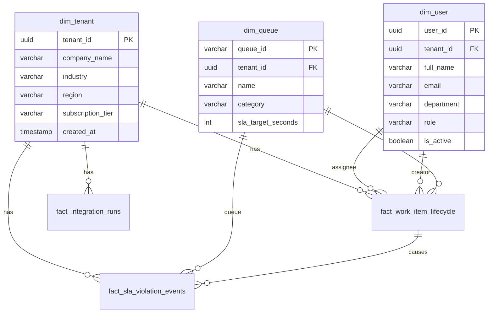

# Nextflow OS – Database DDL and Schema Creation SQL Scripts

**Document ID:** 106_PACK07_DATABASE_DDL_AND_SCHEMA_CREATION_SQL  
**Pack:** 07 — Data, Analytics and Insights  
**Version:** 1.0  
**Status:** Draft v1  
**Primary Owner:** Data Engineering / Database Administration (DBA)  
**Dependent Packs:** 02 Core Platform & Data, 04 Orchestration & Work Management, 05 Integration & Extensibility, 06 Operations & Governance  
**Prerequisite Documents:** 100_PACK07_DATA_ANALYTICS_AND_INSIGHTS_OVERVIEW_AND_STRATEGY, 101_PACK07_DATA_DOMAIN_MODEL_AND_ANALYTICS_SCHEMA, 102_PACK07_CORE_KPIS_AND_STANDARD_DASHBOARDS_PER_WEDGE_AND_ROLE, 105_PACK07_ANALYTICS_OPERATIONS_VERSIONING_AND_QUALITY_PLAYBOOK

---

## 1. Mục tiêu tài liệu

Tài liệu này cung cấp **đặc tả cơ sở dữ liệu vật lý (Physical Schema Specification)** và các đoạn mã lệnh **SQL DDL (Data Definition Language) Scripts** chuẩn hóa của Nextflow OS. Tài liệu này đóng vai trò:
* Hiện thực hóa mô hình dữ liệu phân tích dạng tinh thể (Star/Snowflake Schema) từ doc 101 thành cấu trúc bảng vật lý cụ thể.
* Cung cấp mã SQL DDL tối ưu hóa cho hai hệ quản trị cơ sở dữ liệu chính: **PostgreSQL** (Dành cho lưu trữ và truy vấn báo cáo thời gian thực - Operational Data Store) và **Google BigQuery** (Dành cho hệ thống kho dữ liệu lớn - Data Lakehouse).
* Thiết lập các liên kết khóa ngoại (Foreign Keys), ràng buộc logic (Check Constraints), và chiến lược đánh chỉ mục (Indexing Strategy) để tối ưu hiệu năng truy vấn.
* Xây dựng các Views dữ liệu phân tích chuẩn hóa hỗ trợ trực tiếp cho các Dashboards của Pack 07 - Doc 102.
* Định nghĩa quy chuẩn bảo trì phân vùng dữ liệu (Partition Rotation) nhằm kiểm soát chi phí lưu trữ và duy trì tốc độ truy xuất.

---

## 2. Sơ đồ Quan hệ Cơ sở dữ liệu (Star Schema ERD)

Lớp Analytics của Nextflow OS được tổ chức theo mô hình Star Schema để tối ưu hóa hiệu năng cho các truy vấn tổng hợp (Aggregation Queries) từ Dashboards:



---

## 3. PostgreSQL DDL Scripts (Operational Analytics Store)

PostgreSQL được sử dụng để chạy lớp Operational Analytics (Báo cáo hoạt động thời gian thực dưới 5 phút). Schema này sử dụng schema name riêng biệt là `nf_analytics` để cách ly với Core DB.

```sql
-- Khởi tạo schema phân tích độc lập
CREATE SCHEMA IF NOT EXISTS nf_analytics;

-- =========================================================================
-- 3.1 CÁC BẢNG CHIỀU (DIMENSION TABLES)
-- =========================================================================

-- 3.1.1 Bảng chiều Tenant (dim_tenant)
CREATE TABLE nf_analytics.dim_tenant (
    tenant_id UUID PRIMARY KEY,
    company_name VARCHAR(255) NOT NULL,
    industry VARCHAR(100),
    region VARCHAR(50) DEFAULT 'VN',
    subscription_tier VARCHAR(50) NOT NULL,
    created_at TIMESTAMP WITH TIME ZONE NOT NULL,
    updated_at TIMESTAMP WITH TIME ZONE NOT NULL,
    CONSTRAINT chk_tier CHECK (subscription_tier IN ('FREE', 'STANDARD', 'ENTERPRISE'))
);

-- 3.1.2 Bảng chiều User (dim_user)
CREATE TABLE nf_analytics.dim_user (
    user_id UUID PRIMARY KEY,
    tenant_id UUID NOT NULL,
    full_name VARCHAR(255) NOT NULL,
    email VARCHAR(255) NOT NULL,
    department VARCHAR(100),
    role VARCHAR(50) NOT NULL,
    is_active BOOLEAN DEFAULT TRUE,
    created_at TIMESTAMP WITH TIME ZONE NOT NULL,
    FOREIGN KEY (tenant_id) REFERENCES nf_analytics.dim_tenant(tenant_id) ON DELETE CASCADE
);

-- 3.1.3 Bảng chiều Queue (dim_queue)
CREATE TABLE nf_analytics.dim_queue (
    queue_id VARCHAR(100) PRIMARY KEY,
    tenant_id UUID NOT NULL,
    name VARCHAR(255) NOT NULL,
    category VARCHAR(100) NOT NULL,
    sla_target_seconds INTEGER NOT NULL DEFAULT 3600,
    created_at TIMESTAMP WITH TIME ZONE NOT NULL,
    FOREIGN KEY (tenant_id) REFERENCES nf_analytics.dim_tenant(tenant_id) ON DELETE CASCADE,
    CONSTRAINT chk_sla CHECK (sla_target_seconds > 0)
);

-- =========================================================================
-- 3.2 CÁC BẢNG SỰ KIỆN (FACT TABLES)
-- =========================================================================

-- 3.2.1 Bảng sự kiện Vòng đời Work Item (fact_work_item_lifecycle)
CREATE TABLE nf_analytics.fact_work_item_lifecycle (
    fact_id BIGSERIAL PRIMARY KEY,
    work_item_id UUID NOT NULL,
    tenant_id UUID NOT NULL,
    title VARCHAR(255) NOT NULL,
    category VARCHAR(100) NOT NULL,
    priority VARCHAR(20) NOT NULL,
    source VARCHAR(50) NOT NULL,
    current_status VARCHAR(50) NOT NULL,
    
    creator_id UUID,
    current_assignee_id UUID,
    current_queue_id VARCHAR(100),
    
    created_at TIMESTAMP WITH TIME ZONE NOT NULL,
    due_at TIMESTAMP WITH TIME ZONE,
    started_at TIMESTAMP WITH TIME ZONE,
    completed_at TIMESTAMP WITH TIME ZONE,
    
    handling_time_seconds INTEGER DEFAULT 0,
    queue_wait_time_seconds INTEGER DEFAULT 0,
    is_completed BOOLEAN DEFAULT FALSE,
    is_sla_violated BOOLEAN DEFAULT FALSE,
    
    version INTEGER NOT NULL DEFAULT 1,
    
    FOREIGN KEY (tenant_id) REFERENCES nf_analytics.dim_tenant(tenant_id) ON DELETE CASCADE,
    FOREIGN KEY (creator_id) REFERENCES nf_analytics.dim_user(user_id) ON DELETE SET NULL,
    FOREIGN KEY (current_assignee_id) REFERENCES nf_analytics.dim_user(user_id) ON DELETE SET NULL,
    FOREIGN KEY (current_queue_id) REFERENCES nf_analytics.dim_queue(queue_id) ON DELETE SET NULL,
    CONSTRAINT chk_priority CHECK (priority IN ('LOW', 'MEDIUM', 'HIGH', 'CRITICAL'))
);

-- 3.2.2 Bảng sự kiện Vi phạm SLA (fact_sla_violation_events)
CREATE TABLE nf_analytics.fact_sla_violation_events (
    violation_id BIGSERIAL PRIMARY KEY,
    work_item_id UUID NOT NULL,
    tenant_id UUID NOT NULL,
    queue_id VARCHAR(100) NOT NULL,
    sla_target_seconds INTEGER NOT NULL,
    actual_duration_seconds INTEGER NOT NULL,
    overdue_seconds INTEGER NOT NULL,
    violation_timestamp TIMESTAMP WITH TIME ZONE NOT NULL,
    resolved_at TIMESTAMP WITH TIME ZONE,
    is_resolved BOOLEAN DEFAULT FALSE,
    
    FOREIGN KEY (tenant_id) REFERENCES nf_analytics.dim_tenant(tenant_id) ON DELETE CASCADE,
    FOREIGN KEY (queue_id) REFERENCES nf_analytics.dim_queue(queue_id) ON DELETE CASCADE
);

-- 3.2.3 Bảng sự kiện Chạy Tích hợp (fact_integration_runs)
CREATE TABLE nf_analytics.fact_integration_runs (
    run_id BIGSERIAL PRIMARY KEY,
    tenant_id UUID NOT NULL,
    connector_id VARCHAR(100) NOT NULL,
    run_type VARCHAR(50) NOT NULL,
    status VARCHAR(50) NOT NULL,
    records_processed INTEGER DEFAULT 0,
    records_failed INTEGER DEFAULT 0,
    execution_time_ms INTEGER NOT NULL,
    started_at TIMESTAMP WITH TIME ZONE NOT NULL,
    error_message TEXT,
    
    FOREIGN KEY (tenant_id) REFERENCES nf_analytics.dim_tenant(tenant_id) ON DELETE CASCADE,
    CONSTRAINT chk_run_type CHECK (run_type IN ('INBOUND_PUSH', 'INBOUND_POLL', 'OUTBOUND_SYNC', 'BATCH_EXPORT')),
    CONSTRAINT chk_status CHECK (status IN ('SUCCESS', 'FAILED', 'PARTIAL_SUCCESS'))
);

-- =========================================================================
-- 3.3 CHIẾN LƯỢC ĐÁNH INDEX (INDEXING STRATEGY)
-- =========================================================================

-- Tối ưu hóa truy vấn Dashboard theo từng Tenant
CREATE INDEX idx_fact_work_item_tenant ON nf_analytics.fact_work_item_lifecycle(tenant_id);
CREATE INDEX idx_fact_sla_tenant ON nf_analytics.fact_sla_violation_events(tenant_id);
CREATE INDEX idx_fact_integ_tenant ON nf_analytics.fact_integration_runs(tenant_id);

-- Tối ưu hóa truy vấn báo cáo SLA vi phạm theo thời gian
CREATE INDEX idx_fact_sla_violation_time ON nf_analytics.fact_sla_violation_events(violation_timestamp DESC);

-- Tối ưu hóa tìm kiếm công việc theo Assignee và trạng thái chưa hoàn thành
CREATE INDEX idx_fact_work_item_assignee_status ON nf_analytics.fact_work_item_lifecycle(current_assignee_id) WHERE is_completed = FALSE;

-- Tối ưu hóa tìm kiếm log lỗi integration theo Connector
CREATE INDEX idx_fact_integ_connector ON nf_analytics.fact_integration_runs(connector_id, started_at DESC);
```

---

## 4. BigQuery DDL Scripts (Data Lakehouse Schema)

Trong Google BigQuery, để tối ưu hóa chi phí truy vấn (Query Costs) và tăng tốc độ xử lý hàng triệu bản ghi, chúng ta áp dụng cơ chế **Partitioning** (Phân vùng theo ngày) kết hợp với **Clustering** (Gom cụm theo các trường phân cấp cao như tenant, queue).

```sql
-- Khởi tạo Dataset phân tích lớn
CREATE SCHEMA IF NOT EXISTS nextflow_lakehouse;

-- =========================================================================
-- 4.1 BẢNG CHIỀU BIGQUERY
-- =========================================================================

CREATE TABLE IF NOT EXISTS nextflow_lakehouse.dim_tenant (
    tenant_id STRING NOT NULL,
    company_name STRING NOT NULL,
    industry STRING,
    region STRING,
    subscription_tier STRING,
    created_at TIMESTAMP
);

CREATE TABLE IF NOT EXISTS nextflow_lakehouse.dim_user (
    user_id STRING NOT NULL,
    tenant_id STRING NOT NULL,
    full_name STRING NOT NULL,
    email STRING NOT NULL,
    department STRING,
    role STRING,
    is_active BOOL
);

CREATE TABLE IF NOT EXISTS nextflow_lakehouse.dim_queue (
    queue_id STRING NOT NULL,
    tenant_id STRING NOT NULL,
    name STRING NOT NULL,
    category STRING NOT NULL,
    sla_target_seconds INT64
);

-- =========================================================================
-- 4.2 BẢNG SỰ KIỆN BIGQUERY (SỬ DỤNG PARTITION & CLUSTER)
-- =========================================================================

-- Bảng sự kiện Work Item phân vùng theo ngày tạo và gom cụm theo tenant_id
CREATE TABLE IF NOT EXISTS nextflow_lakehouse.fact_work_item_lifecycle (
    work_item_id STRING NOT NULL,
    tenant_id STRING NOT NULL,
    title STRING,
    category STRING,
    priority STRING,
    source STRING,
    current_status STRING,
    creator_id STRING,
    current_assignee_id STRING,
    current_queue_id STRING,
    created_at TIMESTAMP NOT NULL,
    due_at TIMESTAMP,
    started_at TIMESTAMP,
    completed_at TIMESTAMP,
    handling_time_seconds INT64,
    queue_wait_time_seconds INT64,
    is_completed BOOL,
    is_sla_violated BOOL
)
PARTITION BY DATE(created_at)
CLUSTER BY tenant_id, current_queue_id;

-- Bảng sự kiện vi phạm SLA phân vùng theo ngày vi phạm và gom cụm theo tenant_id
CREATE TABLE IF NOT EXISTS nextflow_lakehouse.fact_sla_violation_events (
    work_item_id STRING NOT NULL,
    tenant_id STRING NOT NULL,
    queue_id STRING NOT NULL,
    sla_target_seconds INT64,
    actual_duration_seconds INT64,
    overdue_seconds INT64,
    violation_timestamp TIMESTAMP NOT NULL,
    resolved_at TIMESTAMP,
    is_resolved BOOL
)
PARTITION BY DATE(violation_timestamp)
CLUSTER BY tenant_id, queue_id;

-- Bảng chạy tích hợp phân vùng theo ngày chạy và gom cụm theo connector_id
CREATE TABLE IF NOT EXISTS nextflow_lakehouse.fact_integration_runs (
    tenant_id STRING NOT NULL,
    connector_id STRING NOT NULL,
    run_type STRING,
    status STRING,
    records_processed INT64,
    records_failed INT64,
    execution_time_ms INT64,
    started_at TIMESTAMP NOT NULL,
    error_message STRING
)
PARTITION BY DATE(started_at)
CLUSTER BY tenant_id, connector_id;
```

---

## 5. Analytics Views (Các View phục vụ Dashboards)

Để lập trình viên Front-end không phải viết các câu lệnh SQL `JOIN` phức tạp trên client, Nextflow OS định nghĩa sẵn các View tổng hợp trực tiếp trên cơ sở dữ liệu.

### 5.1 View 1: Tỉ lệ tuân thủ SLA theo ngày của Tenant (vw_tenant_sla_compliance_daily)

View này tính toán tỉ lệ hoàn thành công việc đúng hạn (SLA Compliance Rate) của từng doanh nghiệp theo ngày:

$$SLA\% = \left( 1 - \frac{\text{Tổng số việc vi phạm SLA}}{\text{Tổng số việc hoàn thành + việc đang trễ hạn}} \right) \times 100$$

```sql
CREATE OR REPLACE VIEW nf_analytics.vw_tenant_sla_compliance_daily AS
SELECT 
    t.tenant_id,
    t.company_name,
    DATE(w.created_at) AS date_record,
    COUNT(w.work_item_id) AS total_work_items,
    COUNT(CASE WHEN w.is_sla_violated = TRUE THEN 1 END) AS total_sla_violations,
    ROUND(
        (1.0 - (COUNT(CASE WHEN w.is_sla_violated = TRUE THEN 1 END)::NUMERIC / NULLIF(COUNT(w.work_item_id), 0))) * 100, 
        2
    ) AS sla_compliance_percentage
FROM nf_analytics.dim_tenant t
JOIN nf_analytics.fact_work_item_lifecycle w ON t.tenant_id = w.tenant_id
GROUP BY t.tenant_id, t.company_name, DATE(w.created_at);
```

---

### 5.2 View 2: Năng suất xử lý của Hàng đợi (vw_queue_throughput_hourly)

View này theo dõi số lượng công việc được xử lý thành công (Throughput) trong mỗi hàng đợi theo từng khung giờ:

```sql
CREATE OR REPLACE VIEW nf_analytics.vw_queue_throughput_hourly AS
SELECT 
    q.tenant_id,
    q.queue_id,
    q.name AS queue_name,
    DATE_TRUNC('hour', w.completed_at) AS completed_hour,
    COUNT(w.work_item_id) AS items_completed_count,
    ROUND(AVG(w.handling_time_seconds)::NUMERIC, 2) AS avg_handling_time_seconds
FROM nf_analytics.dim_queue q
JOIN nf_analytics.fact_work_item_lifecycle w ON q.queue_id = w.current_queue_id
WHERE w.is_completed = TRUE
GROUP BY q.tenant_id, q.queue_id, q.name, DATE_TRUNC('hour', w.completed_at);
```

---

## 6. Database Maintenance & Partition Rotation

Nhằm giữ cho cơ sở dữ liệu PostgreSQL hoạt động mượt mà (dưới 50ms cho các câu lệnh CRUD), Nextflow OS áp dụng quy trình bảo trì xoay vòng dữ liệu tự động cho các bảng Fact lớn.

### 6.1 Cơ chế xoay vòng phân vùng dữ liệu cũ (Partition Rotation)

Bảng log `fact_integration_runs` có tần suất ghi chép cực kỳ lớn (lên tới hàng triệu dòng mỗi tháng đối với khách hàng Enterprise). Chúng ta thiết lập một thủ tục (Stored Procedure) định kỳ chạy vào 01:00 AM hàng ngày để tự động tạo phân vùng cho tháng tiếp theo và chuyển các dữ liệu quá 90 ngày vào dạng nén lưu trữ (Cold storage).

```sql
CREATE OR REPLACE PROCEDURE nf_analytics.rotate_integration_partitions()
LANGUAGE plpgsql AS $$
DECLARE
    next_month_start DATE;
    next_month_partition_name VARCHAR(100);
    query_str TEXT;
BEGIN
    -- Xác định thời gian tháng kế tiếp
    next_month_start := DATE_TRUNC('month', CURRENT_DATE + INTERVAL '1 month');
    next_month_partition_name := 'fact_integration_runs_' || TO_CHAR(next_month_start, 'YYYY_MM');

    -- Kiểm tra và tạo phân vùng mới nếu chưa tồn tại
    IF NOT EXISTS (
        SELECT 1 
        FROM pg_tables 
        WHERE schemaname = 'nf_analytics' AND tablename = LOWER(next_month_partition_name)
    ) THEN
        query_str := 'CREATE TABLE nf_analytics.' || next_month_partition_name || 
                     ' PARTITION OF nf_analytics.fact_integration_runs' ||
                     ' FOR VALUES FROM (''' || next_month_start || ''') TO (''' || (next_month_start + INTERVAL '1 month') || ''')';
        EXECUTE query_str;
        RAISE NOTICE 'Partition % created successfully.', next_month_partition_name;
    ELSE
        RAISE NOTICE 'Partition % already exists.', next_month_partition_name;
    END IF;
    
    -- Quy trình xóa/nén dữ liệu cũ hơn 90 ngày (Nếu cần thực thi xóa)
    -- EXECUTE 'DROP TABLE IF EXISTS nf_analytics.fact_integration_runs_' || TO_CHAR(CURRENT_DATE - INTERVAL '3 months', 'YYYY_MM');
END;
$$;
```
