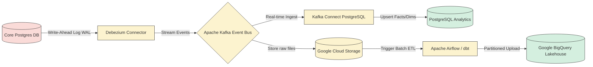

# Nextflow OS – Data Pipeline ETL and Ingestion Specification

**Document ID:** 108_PACK07_DATA_PIPELINE_ETL_AND_INGESTION_SPEC  
**Pack:** 07 — Data, Analytics and Insights  
**Version:** 1.0  
**Status:** Draft v1  
**Primary Owner:** Data Engineering / MLOps  
**Dependent Packs:** 02 Core Platform & Data, 04 Orchestration & Work Management, 05 Integration & Extensibility, 06 Operations & Governance  
**Prerequisite Documents:** 101_PACK07_DATA_DOMAIN_MODEL_AND_ANALYTICS_SCHEMA, 105_PACK07_ANALYTICS_OPERATIONS_VERSIONING_AND_QUALITY_PLAYBOOK, 106_PACK07_DATABASE_DDL_AND_SCHEMA_CREATION_SQL

---

## 1. Mục tiêu tài liệu

Tài liệu này là đặc tả kỹ thuật thiết kế **Đường ống dẫn và Biến đổi dữ liệu (Data Pipeline ETL/ELT & Ingestion Specification)** của Nextflow OS. Tài liệu này đóng vai trò:
* Đặc tả cơ chế đồng bộ dữ liệu từ Cơ sở dữ liệu vận hành thời gian thực (Core Transactional Database) sang Kho dữ liệu phân tích (Operational Analytics Store & Data Lakehouse).
* Chi tiết hóa kiến trúc kỹ thuật sử dụng công nghệ **CDC (Change Data Capture)** để ghi nhận các thay đổi trạng thái công việc mà không làm ảnh hưởng tới hiệu năng của Core DB.
* Định nghĩa các chu kỳ nạp dữ liệu (Ingestion Cadences) tối ưu cho từng quy mô doanh nghiệp SME.
* Cung cấp mã nguồn mẫu cho quy trình điều phối đường ống dữ liệu bằng **Apache Airflow (Python DAG)**.
* Thiết lập các chốt kiểm soát chất lượng dữ liệu (Data Quality Assertions) nhằm phát hiện sớm các dị thường dữ liệu trước khi đưa lên dashboards.
* Thiết kế cơ chế xử lý lỗi tự động và cảnh báo sự cố đường ống dữ liệu (Pipeline Recovery & Alerting).

---

## 2. Kiến trúc Data Pipeline & CDC (Change Data Capture)

Để đảm bảo hiệu năng và tính độc lập của lớp Core Platform (Pack 02) và lớp Analytics (Pack 07), Nextflow OS không sử dụng các câu lệnh truy vấn trực tiếp (`Direct SQL Selects`) trên database vận hành. Thay vào đó, hệ thống sử dụng cơ chế **Change Data Capture (CDC)** dựa trên log của cơ sở dữ liệu.



### 2.1 Các bảng nguồn (Source Tables) được theo dõi CDC
Các bảng dữ liệu trong Core DB được Debezium lắng nghe thay đổi (Create, Update, Delete) gồm:
1. `core_tasks`: Thông tin nhiệm vụ, người thực hiện, thời gian bắt đầu/kết thúc.
2. `core_cases`: Thông tin hồ sơ nghiệp vụ (cha của tasks), trạng thái hồ sơ.
3. `core_queues`: Cấu hình phân phối, thành viên, và SLA targets.
4. `core_integration_logs`: Nhật ký chạy tích hợp của đối tác (Pack 05).
5. `core_incidents`: Sự cố nghiệp vụ và change management logs (Pack 06).

---

## 3. Các chu kỳ nạp dữ liệu (Ingestion Cadence)

Nextflow OS hỗ trợ hai chu kỳ nạp dữ liệu độc lập để tối ưu hóa chi phí tài nguyên:

| Ingestion Type | Source | Target | Cadence (Tần suất) | Target Latency | Use Case |
| :--- | :--- | :--- | :--- | :--- | :--- |
| **Real-Time Streaming** | Core DB Logs | PostgreSQL Analytics | Liên tục (CDC Stream) | < 10 giây | Báo cáo hoạt động trực quan cho Supervisor (Tasks in queue, active users, hourly SLA status). |
| **Micro-Batch ETL** | Cloud Storage | BigQuery Lakehouse | Mỗi 4 tiếng (04:00, 08:00, 12:00, 16:00, 20:00, 00:00) | < 4 giờ | Báo cáo hiệu năng hàng ngày cho SME Leadership, tối ưu hóa staffing, phân tích xu hướng vi phạm SLA. |
| **Daily Batch** | Cloud Storage | BigQuery Lakehouse | 1 lần / ngày (01:30 AM) | < 24 giờ | Tính toán Feature Layer phục vụ huấn luyện mô hình AI (Pack 08), báo cáo tài chính, audit logs. |

---

## 4. Đặc tả luồng xử lý ETL (Apache Airflow DAG Specification)

Quy trình gom dữ liệu thô (Raw Data), làm sạch (Cleansing), chuyển đổi mô hình (Transformation) và nạp (Loading) vào Data Lakehouse được điều phối bởi **Apache Airflow**.

Dưới đây là mã nguồn Python định nghĩa một Airflow DAG chuẩn (`dag_nextflow_analytics_etl.py`) để chạy các tác vụ ETL định kỳ hàng ngày:

```python
from datetime import datetime, timedelta
from airflow import DAG
from airflow.providers.google.cloud.transfers.gcs_to_bigquery import GCSToBigQueryOperator
from airflow.providers.google.cloud.operators.bigquery import BigQueryInsertJobOperator
from airflow.operators.python import PythonOperator
from airflow.utils.trigger_rule import TriggerRule

default_args = {
    'owner': 'data-engineering',
    'depends_on_past': False,
    'start_date': datetime(2026, 7, 1),
    'email': ['alerts.data@nextflow-os.com'],
    'email_on_failure': True,
    'email_on_retry': False,
    'retries': 2,
    'retry_delay': timedelta(minutes=5),
}

# 1. Định nghĩa DAG chạy hàng ngày lúc 01:30 AM (UTC)
with DAG(
    'nextflow_sme_analytics_etl_daily',
    default_args=default_args,
    description='Daily ETL pipeline syncing Core transactions to BigQuery Lakehouse',
    schedule_interval='30 1 * * *',
    catchup=False,
    max_active_runs=1
) as dag:

    # 2. Tác vụ nạp dữ liệu thô từ GCS (dữ liệu dump từ CDC trong ngày) vào BigQuery Staging Table
    load_raw_tasks_to_staging = GCSToBigQueryOperator(
        task_id='load_raw_tasks_to_staging',
        bucket='nextflow-cdc-raw-dumps',
        source_objects=['tasks/{{ ds }}/*.parquet'],
        destination_project_dataset_table='nextflow_staging.raw_tasks',
        source_format='PARQUET',
        write_disposition='WRITE_TRUNCATE', # Ghi đè staging table mỗi ngày
        autodetect=True
    )

    # 3. Tác vụ chạy dbt/SQL để biến đổi dữ liệu từ raw_tasks sang bảng fact_work_item_lifecycle
    # Ở bước này, chúng ta tính toán Handling Time, Queue Wait Time, và cắm cờ vi phạm SLA
    transform_and_upsert_fact_table = BigQueryInsertJobOperator(
        task_id='transform_and_upsert_fact_table',
        configuration={
            "query": {
                "query": """
                    MERGE INTO `nextflow_lakehouse.fact_work_item_lifecycle` T
                    USING (
                        SELECT 
                            id AS work_item_id,
                            tenant_id,
                            title,
                            category,
                            priority,
                            source,
                            status AS current_status,
                            creator_id,
                            assignee_id AS current_assignee_id,
                            queue_id AS current_queue_id,
                            created_at,
                            due_at,
                            started_at,
                            completed_at,
                            -- Tính toán thời gian xử lý thực tế (Handling Time)
                            TIMESTAMP_DIFF(completed_at, started_at, SECOND) AS handling_time_seconds,
                            -- Tính toán thời gian nằm chờ trong hàng đợi (Queue Wait Time)
                            TIMESTAMP_DIFF(started_at, created_at, SECOND) AS queue_wait_time_seconds,
                            -- Xác định trạng thái hoàn thành
                            IF(status = 'COMPLETED', TRUE, FALSE) AS is_completed,
                            -- Xác định vi phạm SLA dựa trên thời gian thực tế so với target của queue
                            IF(completed_at > due_at OR (completed_at IS NULL AND CURRENT_TIMESTAMP() > due_at), TRUE, FALSE) AS is_sla_violated
                        FROM `nextflow_staging.raw_tasks`
                    ) S
                    ON T.work_item_id = S.work_item_id AND T.tenant_id = S.tenant_id
                    WHEN MATCHED THEN
                        UPDATE SET 
                            T.current_status = S.current_status,
                            T.current_assignee_id = S.current_assignee_id,
                            T.current_queue_id = S.current_queue_id,
                            T.completed_at = S.completed_at,
                            T.handling_time_seconds = S.handling_time_seconds,
                            T.is_completed = S.is_completed,
                            T.is_sla_violated = S.is_sla_violated
                    WHEN NOT MATCHED THEN
                        INSERT (work_item_id, tenant_id, title, category, priority, source, current_status, creator_id, current_assignee_id, current_queue_id, created_at, due_at, started_at, completed_at, handling_time_seconds, queue_wait_time_seconds, is_completed, is_sla_violated)
                        VALUES(S.work_item_id, S.tenant_id, S.title, S.category, S.priority, S.source, S.current_status, S.creator_id, S.current_assignee_id, S.current_queue_id, S.created_at, S.due_at, S.started_at, S.completed_at, S.handling_time_seconds, S.queue_wait_time_seconds, S.is_completed, S.is_sla_violated)
                """,
                "useLegacySql": False,
            }
        }
    )

    # 4. Hàm Python kiểm tra chất lượng dữ liệu sau khi biến đổi
    def verify_data_quality_assertions(**kwargs):
        # Đoạn code này giả lập kết nối và chạy kiểm định dữ liệu
        # Ví dụ: kiểm tra xem có bản ghi nào bị âm Handling Time không (lỗi logic thời gian)
        print("[Data Quality] Running assertions for date: ", kwargs['ds'])
        
        # Nếu phát hiện lỗi nghiêm trọng, raise Exception để ngắt pipeline
        # raise ValueError("Found handling_time_seconds < 0 inside fact table!")
        print("[Data Quality] All assertions passed successfully!")

    run_data_quality_checks = PythonOperator(
        task_id='run_data_quality_checks',
        python_callable=verify_data_quality_assertions,
        provide_context=True
    )

    # Thiết lập luồng chạy tuần tự
    load_raw_tasks_to_staging >> transform_and_upsert_fact_table >> run_data_quality_checks
```

---

## 5. Đảm bảo chất lượng dữ liệu & Ràng buộc (Data Quality Assertions)

Để tránh tình trạng "Rác vào thì Rác ra" (Garbage In, Garbage Out) gây sai lệch số liệu trên Dashboards của doanh nghiệp, Data Pipeline thực thi các quy tắc kiểm tra chất lượng dữ liệu tự động ở mức staging trước khi đưa vào bảng Fact chính thức.

### 5.1 Các quy tắc kiểm định cốt lõi (Data Quality Rules)

| Rule ID | Target Field | Quality Dimension | Assertion (Quy tắc kiểm tra) | Action on Failure |
| :--- | :--- | :--- | :--- | :--- |
| `DQ_001` | `work_item_id`, `tenant_id` | Completeness | Không được phép `NULL` hoặc chứa ký tự trống. | Bỏ qua bản ghi, đẩy vào Error Log. |
| `DQ_002` | `work_item_id` | Uniqueness | Không được phép có bản ghi trùng lặp ID trong cùng một tenant (Deduplication). | Chỉ lấy bản ghi có `version` hoặc `updated_at` mới nhất. |
| `DQ_003` | `handling_time_seconds` | Validity | Giá trị phải $\ge 0$. Nếu `completed_at` < `started_at` -> Lỗi thời gian hệ thống. | Thiết lập giá trị mặc định là 0, ghi nhận cảnh báo. |
| `DQ_004` | `tenant_id` | Consistency | ID của Tenant phải tồn tại trong bảng chiều `dim_tenant` (Ràng buộc toàn vẹn). | Ngắt kết nối nạp (Pipeline Alert), ngắt luồng. |

---

## 6. Xử lý sự cố và Cảnh báo (Pipeline Failures & Alerting)

### 6.1 Cơ chế Dead Letter Queue (DLQ)
Khi các bản ghi dữ liệu thô gặp lỗi định dạng nghiêm trọng (ví dụ JSON bị méo cấu trúc, sai kiểu dữ liệu hệ thống không thể tự parse), các bản ghi này sẽ được cách ly tự động vào **Dead Letter Queue (DLQ)** của Kafka hoặc thư mục `/archive/failed-payloads/` trên GCS để kỹ thuật viên kiểm tra thủ công, tránh làm tắc nghẽn luồng dữ liệu chính.

### 6.2 Hệ thống cảnh báo tự động (Alerting Gateway)
Khi một task trong Airflow bị lỗi liên tiếp 2 lần (sau khi đã tự retry), hoặc khi phát hiện lỗi dữ liệu nghiêm trọng ở chốt `run_data_quality_checks`, Airflow sẽ kích hoạt webhook gửi cảnh báo sự cố đến kênh Slack kỹ thuật và PagerDuty theo format:

```json
{
  "alert": "PIPELINE_CRITICAL_FAILURE",
  "pipeline_name": "nextflow_sme_analytics_etl_daily",
  "failed_task": "transform_and_upsert_fact_table",
  "execution_date": "2026-07-03",
  "error_reason": "Google BigQuery API Exception: Partition field limit exceeded.",
  "severity": "CRITICAL",
  "action_required": "DBA needs to inspect the daily partitioning job."
}
```
Dựa vào tín hiệu cảnh báo này, đội ngũ vận hành kỹ thuật (Pack 06) sẽ khởi động quy trình ứng phó sự cố IT (Incident Response Playbook 92) để khắc phục lỗi và chạy lại (backfill) dữ liệu.
