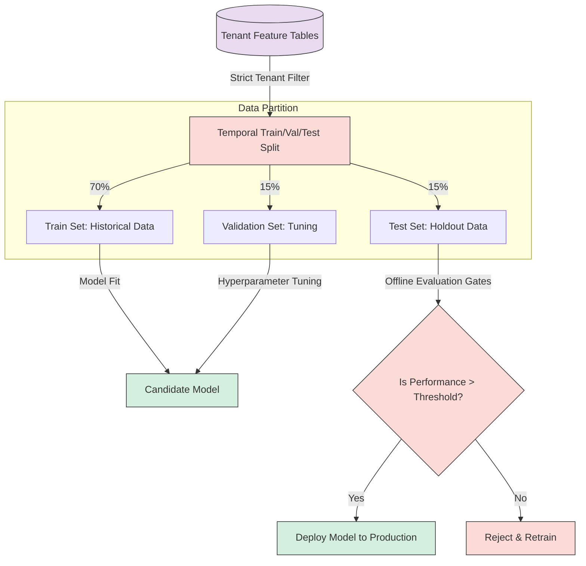
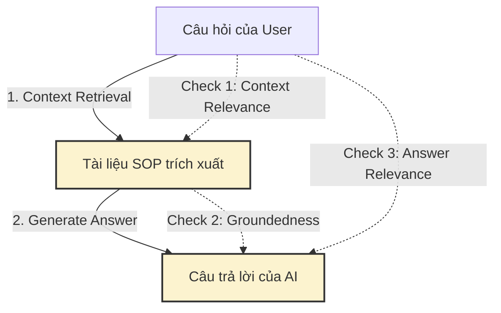

# Nextflow OS – AI Model Performance Testing and Evaluation Metrics Specification

**Document ID:** 129B_PACK08_MODEL_PERFORMANCE_TESTING_AND_EVALUATION_METRICS  
**Pack:** 08 — Advanced Intelligence, Recommendations and Assistants  
**Version:** 1.0  
**Status:** Draft v1  
**Primary Owner:** Data Science / MLOps / QA Systems  
**Dependent Packs:** 02 Core Platform & Data, 04 Orchestration & Work Management, 06 Operations & Governance, 07 Data, Analytics & Insights  
**Prerequisite Documents:** 120_PACK08_INTELLIGENCE_OVERVIEW_AND_STRATEGY, 121_PACK08_INTELLIGENCE_USE_CASES_FOR_SMES, 122_PACK08_INTELLIGENCE_DATA_AND_FEATURE_LAYER_SPEC, 123_PACK08_INTELLIGENCE_MODEL_AND_LOGIC_ARCHITECTURE, 124_PACK08_AI_GOVERNANCE_RISK_AND_GUARDRAILS

---

## 1. Mục tiêu tài liệu

Tài liệu này định nghĩa **Bộ tiêu chuẩn Kiểm định và Đo lường Hiệu năng Mô hình Trí tuệ Nhân tạo (AI Model Performance & Evaluation Metrics Specification)** cho Nextflow OS. Tài liệu này đóng vai trò:
* Thiết lập các chốt kiểm định chất lượng toán học cho các mô hình AI/ML trước khi phát hành (Pre-deployment Validation Gates).
* Định nghĩa quy chuẩn phân tách dữ liệu huấn luyện (Data Splitting Rules) đảm bảo tính cô lập và bảo mật thông tin giữa các doanh nghiệp (Multi-tenant Data Isolation).
* Đặc tả các chỉ số đánh giá hiệu năng (Performance Metrics) chi tiết cho 3 nhóm mô hình AI cốt lõi: Phân loại rủi ro SLA, Hệ đề xuất định tuyến và Trợ lý RAG tri thức.
* Thiết kế cơ chế giám sát lệch pha mô hình (Model & Concept Drift Detection) trong thời gian thực.
* Xây dựng kịch bản ứng phó khẩn cấp (Kill Switches) và cơ chế tự động chuyển đổi dự phòng (Fallback to Rules-based).

---

## 2. Quy trình chia tập dữ liệu huấn luyện (Data Splitting & Tenant Isolation)

Để huấn luyện và đánh giá mô hình AI một cách khách quan mà không vi phạm chính sách bảo mật dữ liệu của doanh nghiệp (Pack 06), Nextflow OS áp dụng quy trình phân tách dữ liệu nghiêm ngặt.

### 2.1 Nguyên tắc cô lập dữ liệu (Tenant Isolation in ML)

* **No Cross-Tenant Training (Không học chéo):** Không gộp chung dữ liệu nhạy cảm của các Tenant khác nhau để huấn luyện một mô hình duy nhất (trừ phi mô hình đó là mô hình nền tảng ngôn ngữ chung không chứa thông tin kinh doanh). Dữ liệu tính năng (`Feature Tables`) được trích xuất từ Pack 07 bắt buộc phải chạy qua bộ lọc `tenant_id`.
* **Phân tách theo Thời gian (Temporal Splitting):** Do dữ liệu vận hành doanh nghiệp có tính chuỗi thời gian (time-series), chúng ta tuyệt đối không dùng phương pháp chia ngẫu nhiên (Random K-Fold Cross-Validation) vì sẽ gây rò rỉ thông tin tương lai về quá khứ (Data Leakage). 
  * *Tỉ lệ phân chia:* 70% dữ liệu lịch sử đầu tiên dùng để Huấn luyện (Train), 15% tiếp theo dùng để Tinh chỉnh tham số (Validation), và 15% dữ liệu mới nhất dùng để Kiểm định độc lập (Holdout Test).

---

## 3. Chỉ số đo lường hiệu năng theo nhóm mô hình AI (Model Evaluation Metrics)

Nextflow OS định nghĩa 3 nhóm chỉ số tương ứng với 3 dòng use cases AI lớn quy định trong Pack 08 - Doc 121.

### 3.1 Nhóm 1: Mô hình Dự báo Rủi ro SLA (Phân loại Nhị phân - Classification)
* **Use Case tiêu biểu:** Dự đoán xem một công việc (Work Item) có nguy cơ bị vi phạm SLA hay không (Use Case A1).
* **Các chỉ số đo lường bắt buộc:**

| Metric Name | Formula | Target Threshold | Business Meaning |
| :--- | :--- | :--- | :--- |
| **Precision** (Độ chính xác) | $\frac{TP}{TP + FP}$ | $\ge 85\%$ | Hạn chế cảnh báo giả (False Alarms) để tránh gây chai lỳ tâm lý (Alert Fatigue) cho nhân viên vận hành. |
| **Recall** (Độ nhạy) | $\frac{TP}{TP + FN}$ | $\ge 90\%$ | Đảm bảo không bỏ sót các trường hợp thực sự sắp bị trễ hạn nguy hiểm. |
| **F1-Score** | $2 \times \frac{\text{Precision} \times \text{Recall}}{\text{Precision} + \text{Recall}}$ | $\ge 87\%$ | Chỉ số trung bình điều hòa, đánh giá tổng thể mô hình khi dữ liệu mất cân bằng (Imbalanced Data). |
| **AUC-ROC** | Area under ROC Curve | $\ge 0.90$ | Khả năng phân biệt giữa công việc trễ hạn và đúng hạn của mô hình. |

---

### 3.2 Nhóm 2: Mô hình Đề xuất phân phối công việc (Hệ khuyến nghị - Recommendation)
* **Use Case tiêu biểu:** Đề xuất nhân viên phù hợp nhất trong Queue để giải quyết Task dựa trên năng lực và tải lượng công việc (Use Case A2).
* **Các chỉ số đo lường bắt buộc:**

#### 3.2.1 NDCG@3 (Normalized Discounted Cumulative Gain tại Top 3)
Chỉ số này đánh giá xem các gợi ý tốt nhất có được xếp ở đầu danh sách hay không. Nextflow yêu cầu gợi ý chính xác phải nằm trong top 3 đề xuất hiển thị trên Side Panel.

$$\text{DCG}_p = \sum_{i=1}^{p} \frac{2^{rel_i} - 1}{\log_2(i + 1)} \quad \Longrightarrow \quad \text{NDCG}_p = \frac{\text{DCG}_p}{\text{IDCG}_p}$$

* **Target Threshold:** $\text{NDCG@3} \ge 0.82$.

#### 3.2.2 MAP (Mean Average Precision)
Đo lường độ chính xác trung bình của danh sách gợi ý trên toàn bộ các lượt phân phối công việc.
* **Target Threshold:** $\text{MAP} \ge 0.78$.

---

### 3.3 Nhóm 3: Trợ lý Tri thức SOP (Hệ thống Generative AI / RAG)
* **Use Case tiêu biểu:** Chatbot trả lời câu hỏi của nhân viên dựa trên kho tài liệu quy trình SOP nội bộ của công ty (Use Case D1).
* **Chỉ số đo lường bắt buộc (theo khung TruLens/Ragas):**

1. **Groundedness (Tính trung thực/Không ảo giác):**
   * *Định nghĩa:* Đánh giá xem câu trả lời của AI có hoàn toàn dựa trên tài liệu SOP được trích xuất (Context) hay tự bịa ra.
   * *Target Threshold:* $\ge 0.95$ (Tuyệt đối không được phép ảo giác thông tin nghiệp vụ).
2. **Answer Relevance (Sự liên quan của câu trả lời):**
   * *Định nghĩa:* Câu trả lời có đúng trọng tâm câu hỏi của nhân viên hay đi vòng vo lạc đề.
   * *Target Threshold:* $\ge 0.90$.
3. **Context Recall (Khả năng tìm đúng tài liệu):**
   * *Định nghĩa:* Hệ thống RAG có tìm được đúng phân đoạn tài liệu SOP chứa câu trả lời cho câu hỏi đó hay không.
   * *Target Threshold:* $\ge 0.88$.

---

## 4. Phát hiện Lệch dữ liệu và mô hình (Model Drift & Concept Drift)

Khi vận hành thực tế, thói quen làm việc của nhân viên hoặc quy trình kinh doanh của SME có thể thay đổi, khiến mô hình AI bị giảm hiệu năng theo thời gian. Nextflow OS tích hợp module giám sát tự động để phát hiện hiện tượng này.

### 4.1 Chỉ số ổn định phân phối (Population Stability Index - PSI)
Chúng ta so sánh phân phối của các biến tính năng đầu vào (hoặc kết quả dự đoán đầu ra của AI) của tuần hiện tại so với dữ liệu huấn luyện ban đầu.

$$\text{PSI} = \sum \left( (Actual\% - Expected\%) \times \ln\left(\frac{Actual\%}{Expected\%}\right) \right)$$

* **Ngưỡng hành động (PSI Action Thresholds):**
  * $\text{PSI} < 0.1$: Hệ thống ổn định. Không cần hành động.
  * $0.1 \le \text{PSI} < 0.25$: Lệch nhẹ. Hệ thống ghi nhận cảnh báo (Warning) và đưa vào danh sách theo dõi sát.
  * $\text{PSI} \ge 0.25$: Lệch nghiêm trọng (Significant Drift). Hệ thống tự động kích hoạt **Pipeline tự huấn luyện lại mô hình (Auto-retraining Pipeline)** và gửi báo cáo cho đội MLOps.

---

## 5. AI Validation Gates & Fallback (Chốt kiểm duyệt an toàn)

### 5.1 Chốt kiểm duyệt CI/CD (Pre-deployment Gates)
Trước khi một phiên bản mô hình AI mới được phát hành tự động (CD), hệ thống bắt buộc phải chạy qua một kịch bản kiểm thử tự động (Validation Job):
1. Chạy đánh giá offline trên tập dữ liệu Holdout Test.
2. So sánh các chỉ số (Precision, Recall, NDCG) của mô hình mới so với mô hình đang chạy thực tế (Champion vs Challenger).
3. **Quy tắc phát hành:** Chỉ tự động promote mô hình Challenger lên Production khi các chỉ số của nó vượt trội hơn mô hình Champion ít nhất $2\%$ và không có chỉ số nào bị tụt dưới ngưỡng Target Threshold quy định ở Mục 3.

### 5.2 Cơ chế Chuyển đổi dự phòng (Fallback to Rules-Based) & Kill Switches
* **Automatic Fallback (Dự phòng tự động):** Nếu hệ thống giám sát phát hiện độ chính xác (Precision) thực tế trong sản xuất của mô hình dự báo SLA tụt xuống dưới $70\%$ liên tục trong 24 giờ, hệ thống sẽ tự động ngắt mô hình AI và chuyển sang chế độ **Rules-based logic** (ví dụ: cảnh báo trễ hạn đơn thuần dựa trên mốc thời gian cứng do Admin cấu hình).
* **Manual Kill Switch (Nút ngắt khẩn cấp):** Tại Admin Console của Tenant, admin có quyền nhấn nút ngắt khẩn cấp hoạt động của AI Assistant nếu phát hiện AI trả lời sai lệch thông tin nghiêm trọng, đưa hệ thống về trạng thái vận hành thủ công truyền thống một cách an toàn mà không làm gián đoạn dòng công việc.
