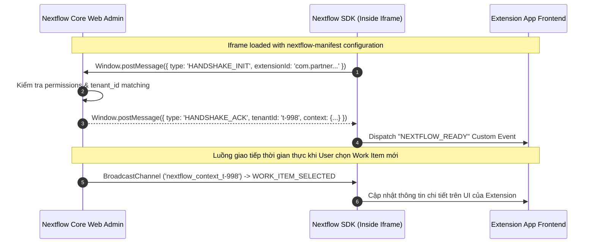
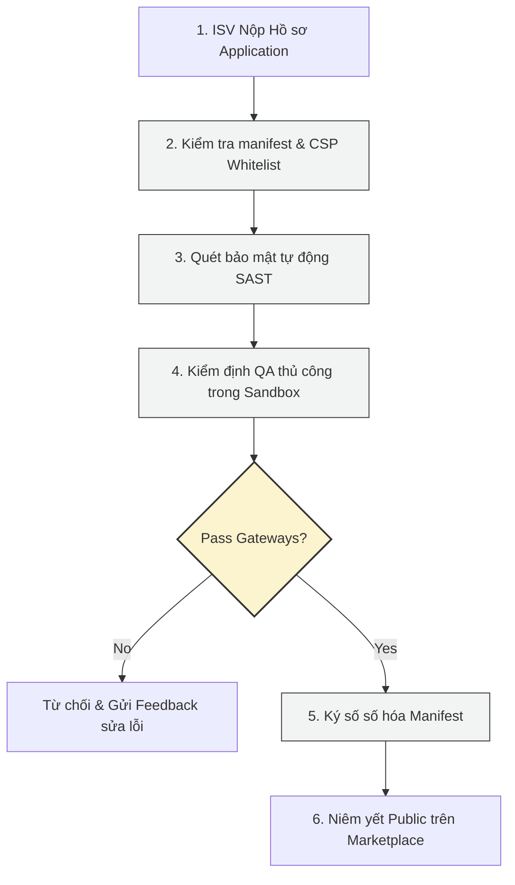

# Nextflow OS – Developer Quickstart and Extension SDK Guide

**Document ID:** 149_PACK09_DEVELOPER_QUICKSTART_AND_SDK_GUIDE  
**Pack:** 09 — Ecosystem, Marketplace and Extensions  
**Version:** 1.0  
**Status:** Draft v1  
**Primary Owner:** Developer Relations / Core Platform Architecture  
**Dependent Packs:** 02 Core Platform & Data, 03 Experience & UX, 05 Integration & Extensibility, 06 Operations & Governance  
**Prerequisite Documents:** 140_PACK09_ECOSYSTEM_AND_MARKETPLACE_OVERVIEW_AND_STRATEGY, 141_PACK09_EXTENSION_AND_APP_MODEL_SPEC, 142_PACK09_MARKETPLACE_CATALOG_AND_LISTING_MODEL, 146_PACK09_ASSET_LISTING_AND_REVIEW_CHECKLIST

---

## 1. Mục tiêu tài liệu

Tài liệu này là **Cẩm nang hướng dẫn phát triển ứng dụng mở rộng (Developer Quickstart & Extension SDK Guide)** dành cho các đối tác phát triển phần mềm độc lập (ISVs) và đội ngũ kỹ thuật nội bộ của Nextflow OS. Tài liệu này cung cấp:
* Hướng dẫn thiết lập môi trường giả lập (Local Sandbox) để chạy thử nghiệm các ứng dụng mở rộng.
* Định nghĩa cấu trúc tệp Manifest bắt buộc (`nextflow-manifest.json`) khai báo quyền và loại ứng dụng.
* Mô tả cơ chế bảo mật Iframe Sandbox và luồng bắt tay giao tiếp (Handshake) thời gian thực qua Web BroadcastChannel API.
* Cung cấp mã nguồn mẫu (React/TypeScript component) sử dụng **Nextflow Extension SDK** để kết nối trực tiếp với giao diện cốt lõi của hệ thống.
* Danh mục kiểm tra điều kiện xuất bản ứng dụng (App Submission & Review Checklist) lên Marketplace.

---

## 2. Thiết lập Môi trường Phát triển (Local Sandbox Setup)

Để bắt đầu xây dựng một ứng dụng mở rộng (Extension), nhà phát triển cần cài đặt bộ công cụ CLI của Nextflow và chạy môi trường giả lập local sandbox.

### 2.1 Cài đặt Nextflow CLI & Khởi tạo dự án
```bash
# 1. Cài đặt CLI toàn cục
npm install -g @nextflow-os/cli

# 2. Khởi tạo dự án extension mới từ template mẫu
nextflow-cli init my-custom-extension --template=react-ts

# 3. Di chuyển vào thư mục dự án và khởi chạy môi trường sandbox cục bộ
cd my-custom-extension
npm install
nextflow-cli sandbox start
```
Môi trường sandbox sẽ khởi chạy một server Nextflow Core giả lập tại địa chỉ `http://localhost:9000` và nhúng code Extension của bạn (đang chạy tại `http://localhost:3000`) vào giao diện Web Admin.

---

### 2.2 Cấu trúc Manifest bắt buộc (nextflow-manifest.json)
Mọi ứng dụng tải lên Nextflow Marketplace bắt buộc phải chứa tệp manifest mô tả siêu dữ liệu, phân quyền và ranh giới bảo mật.

```json
{
  "manifest_version": "1.0",
  "id": "com.partner.shippingtracker",
  "name": "Shipping & Delivery Tracker",
  "version": "1.2.0",
  "description": "Tự động đồng bộ và hiển thị trạng thái vận chuyển thời gian thực từ các đơn vị vận chuyển hàng đầu.",
  "developer": {
    "name": "SME Partner Solutions",
    "website": "https://partner-solutions.com"
  },
  "entry_points": {
    "panel": {
      "target_surface": "WORK_ITEM_DETAILS_SIDE_PANEL",
      "url": "http://localhost:3000/side-panel"
    },
    "settings": {
      "target_surface": "TENANT_SETTINGS_INTEGRATIONS",
      "url": "http://localhost:3000/settings"
    }
  },
  "required_permissions": [
    "work_item:read",
    "work_item:write",
    "tenant_profile:read"
  ],
  "security_policy": {
    "sandbox_flags": "allow-scripts allow-same-origin allow-popups",
    "csp_connect_src": [
      "https://api.shipping-partner.com",
      "https://api.nextflow-os.com"
    ]
  }
}
```

---

## 3. Kiến trúc SDK & Cơ chế Bắt tay Giao tiếp (Handshake API)

Do Nextflow OS chạy trên mô hình bảo mật nhiều lớp (Multi-tenant Security), tất cả các giao diện của bên thứ ba đều được nhúng dưới dạng **Iframe có thuộc tính Sandbox bảo mật**. 



Để truyền nhận dữ liệu thời gian thực giữa giao diện Nextflow Host và ứng dụng trong Iframe mà không vi phạm chính sách Cross-Origin, SDK sử dụng lớp **BroadcastChannel API** được cấu hình động theo `tenant_id`.

---

## 4. Mã nguồn mẫu: Giao diện Extension nhúng Side Panel (React/TypeScript)

Dưới đây là mã nguồn React Component sử dụng gói npm `@nextflow-os/extension-sdk` để kết nối, lắng nghe thông tin của `Work Item` đang được chọn trên màn hình chính và hiển thị dữ liệu bổ trợ từ API bên thứ ba.

```tsx
import React, { useEffect, useState } from 'react';
import { NextflowSDK, WorkItemContext } from '@nextflow-os/extension-sdk';

const sdk = new NextflowSDK();

export const ShippingTrackerPanel: React.FC = () => {
  const [isReady, setIsReady] = useState(false);
  const [tenantContext, setTenantContext] = useState<any>(null);
  const [activeWorkItem, setActiveWorkItem] = useState<WorkItemContext | null>(null);
  const [shippingStatus, setShippingStatus] = useState<string>("Loading tracker info...");

  useEffect(() => {
    // 1. Khởi chạy quá trình kết nối (Handshake) với Nextflow Host
    sdk.connect()
      .then((context) => {
        setIsReady(true);
        setTenantContext(context.tenant);
        console.log("[Extension SDK] Connected successfully. Tenant ID:", context.tenant.id);
      })
      .catch((err) => {
        console.error("[Extension SDK] Handshake failed:", err);
      });

    // 2. Đăng ký lắng nghe sự kiện khi người dùng click chọn một Work Item khác trên Host UI
    const handleWorkItemChange = (workItem: WorkItemContext) => {
      setActiveWorkItem(workItem);
      fetchShippingStatus(workItem.externalId || workItem.id);
    };

    sdk.on('WORK_ITEM_SELECTED', handleWorkItemChange);

    // Dọn dẹp listener khi unmount component
    return () => {
      sdk.off('WORK_ITEM_SELECTED', handleWorkItemChange);
    };
  }, []);

  // Giả lập hàm gọi API lấy thông tin vận chuyển ngoài
  const fetchShippingStatus = async (id: string) => {
    setShippingStatus("Fetching real-time tracking logs...");
    try {
      // Gọi lên Server của Extension (nằm trong CSP whitelist)
      const res = await fetch(`https://api.shipping-partner.com/v1/track/${id}`);
      const data = await res.json();
      setShippingStatus(data.status_description || "Đang vận chuyển");
    } catch (err) {
      setShippingStatus("Không tìm thấy thông tin vận đơn.");
    }
  };

  // Hàm cập nhật ngược lại dữ liệu sang Nextflow Core thông qua SDK
  const handleUpdateNotes = async () => {
    if (activeWorkItem && sdk.hasPermission('work_item:write')) {
      await sdk.executeAction('UPDATE_WORK_ITEM_METADATA', {
        id: activeWorkItem.id,
        metadata: {
          last_tracked_at: new Date().toISOString(),
          tracking_status: shippingStatus
        }
      });
      sdk.showToast("Cập nhật thông tin vận chuyển thành công!", "SUCCESS");
    } else {
      sdk.showToast("Bạn không có quyền chỉnh sửa (work_item:write).", "ERROR");
    }
  };

  if (!isReady) {
    return <div className="loading-spinner">Đang thiết lập kết nối an toàn với Nextflow OS...</div>;
  }

  return (
    <div style={{ padding: '16px', fontFamily: 'Inter, sans-serif' }}>
      <h3>📦 Shipping & Delivery Tracker</h3>
      <p style={{ fontSize: '12px', color: '#666' }}>Tenant: {tenantContext?.name}</p>
      
      {activeWorkItem ? (
        <div style={{ background: '#f5f5f7', padding: '12px', borderRadius: '8px' }}>
          <h4>Công việc hiện tại:</h4>
          <p><strong>Tiêu đề:</strong> {activeWorkItem.title}</p>
          <p><strong>Mã Vận Đơn (External ID):</strong> {activeWorkItem.externalId || 'N/A'}</p>
          
          <div style={{ marginTop: '16px', padding: '8px', borderLeft: '4px solid #007aff', background: '#eef6ff' }}>
            <strong>Trạng thái vận chuyển:</strong> {shippingStatus}
          </div>

          <button 
            onClick={handleUpdateNotes}
            style={{
              marginTop: '16px',
              padding: '8px 12px',
              backgroundColor: '#007aff',
              color: '#fff',
              border: 'none',
              borderRadius: '6px',
              cursor: 'pointer'
            }}
          >
            Đồng bộ sang Nextflow Tasks
          </button>
        </div>
      ) : (
        <div className="empty-state">Vui lòng chọn một công việc trong danh sách để xem trạng thái vận đơn.</div>
      )}
    </div>
  );
};
```

---

## 5. Quy trình Kiểm duyệt & Xuất bản (App Submission Checklist)

Trước khi ứng dụng của bạn được niêm yết công khai trên Nextflow Marketplace, đội ngũ Kiểm duyệt Hệ sinh thái (Ecosystem Governance Team) sẽ thực thi quy trình kiểm duyệt (Pack 09 - Doc 146).



### Các tiêu chí kiểm tra bắt buộc (Submission Checklist)

* [ ] **Bảo mật và Quyền hạn:** Quyền yêu cầu (`required_permissions`) phải tuân thủ nguyên tắc Đặc quyền tối thiểu (Least Privilege).
* [ ] **Cô lập dữ liệu (Tenant Boundaries):** Không được chứa bất kỳ đoạn mã lệnh nào gọi chéo API giữa các tenants.
* [ ] **Chính sách CSP Whitelist:** Mọi URL kết nối ngoài phải được khai báo cụ thể trong CSP Header của tệp Manifest.
* [ ] **Tính nhất quán về trải nghiệm (UX Alignment):** Phông chữ, màu sắc nút bấm và bảng trạng thái phải tuân thủ hướng dẫn UI/UX Pack 03 và Pack 09 - Doc 144.
* [ ] **Tài liệu hướng dẫn:** Phải đính kèm file hướng dẫn thiết lập chi tiết dành cho Tenant Admin và thông tin liên hệ hỗ trợ kỹ thuật (L1/L2 Support).
