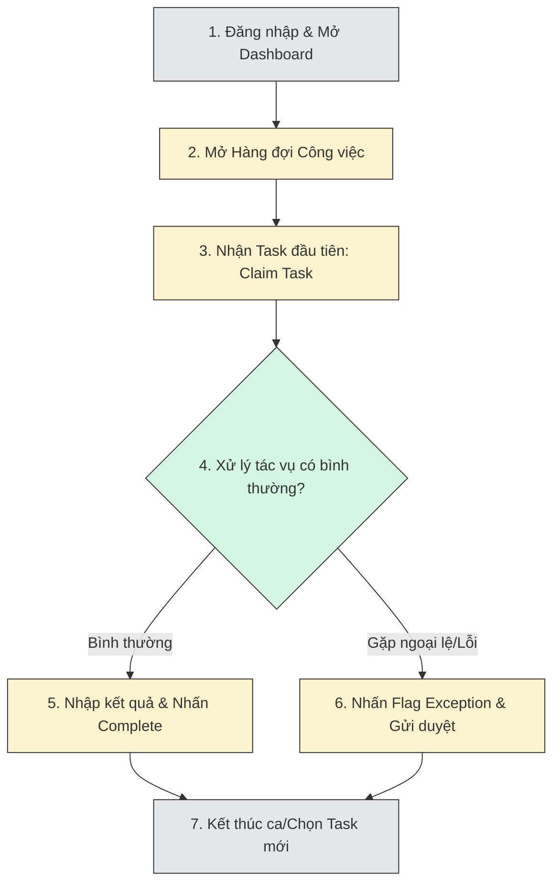
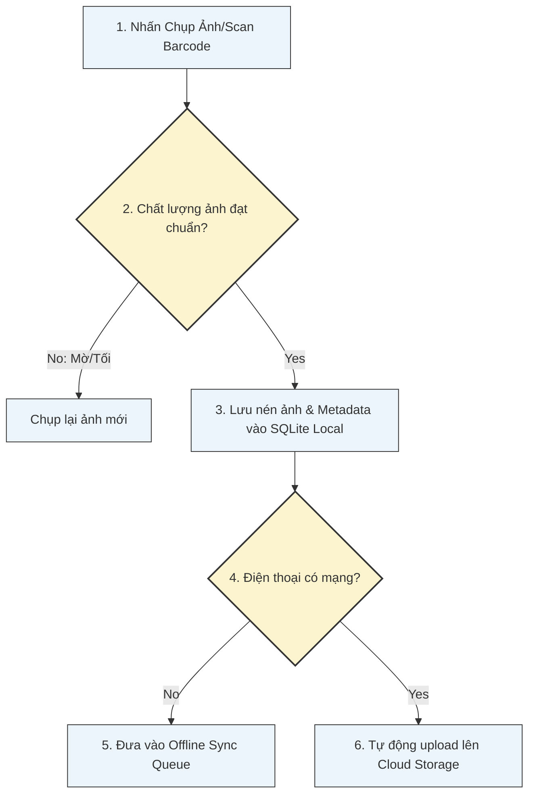

# Nextflow OS – SME End-User Operational Playbook

**Document ID:** 150_SME_END_USER_OPERATIONAL_PLAYBOOK  
**Pack:** 03 — Experience & UX  
**Version:** 1.0  
**Status:** Draft v1  
**Primary Owner:** Product Operations / Customer Success / Training & Enablement  
**Dependent Packs:** 02 Core Platform & Data, 04 Orchestration & Work Management, 06 Operations & Governance  
**Prerequisite Documents:** 20_EXPERIENCE_STRATEGY_OVERVIEW, 21_WEB_ADMIN_EXPERIENCE_STRATEGY, 22_MOBILE_OPS_EXPERIENCE_STRATEGY, 30_PERSONA_BASED_LANDING_AND_DEFAULT_VIEWS, 39_MOBILE_OFFLINE_RESILIENCE_AND_INTERRUPTION_PATTERNS, 59_MOBILE_RESILIENCE_PLAYBOOK_FOR_FIELD_OPERATIONS, 61_SUPPORT_AND_TROUBLESHOOTING_GUIDE_FOR_NEXTFLOW_PILOTS, 64_FAQ_FOR_FIELD_USERS_ON_MOBILE_OPS_AND_CONTINUITY

---

## 1. Mục tiêu tài liệu

Tài liệu này là **Cẩm nang vận hành thực tế dành cho doanh nghiệp SME (SME End-User Operational Playbook)** sử dụng Nextflow OS. Tài liệu này dịch chuyển các định nghĩa thiết kế hệ thống phức tạp trong Pack 03 thành các hướng dẫn thao tác thực tế từng bước:
* Giúp Quản trị viên doanh nghiệp (Tenant Admin) thiết lập và vận hành không gian làm việc của công ty hiệu quả.
* Hướng dẫn nhân viên văn phòng (Web Admin staff) nhận diện, xử lý công việc và quản lý các ngoại lệ (Exceptions).
* Hướng dẫn nhân viên ngoài hiện trường (Mobile Field Workers) thao tác tác vụ, làm việc ngoại tuyến (Offline mode) và lưu trữ minh chứng vận hành.
* Tổng hợp các tình huống lỗi thường gặp và các bước tự khắc phục nhanh (Self-troubleshooting) cho người dùng cuối.

---

## 2. Hướng dẫn cho Quản trị viên Doanh nghiệp (Tenant Administrator Guide)

Quản trị viên Tenant chịu trách nhiệm thiết lập nền móng ban đầu để Nextflow OS có thể phân phối công việc đúng người, đúng luật.

### 2.1 Thiết lập Workspace & Khởi tạo phòng ban
1. Đăng nhập vào cổng **Nextflow Admin Console** bằng tài khoản Admin được cấp.
2. Truy cập mục **Settings > Company Profile**: Cập nhật thông tin công ty, múi giờ và lịch làm việc hành chính (Working Calendar).
3. Truy cập **Identity > Departments**: Khởi tạo cấu trúc phòng ban (ví dụ: Sales, Finance, Delivery, Customer Support).

---

### 2.2 Tạo người dùng và Phân vai (Role & User Allocation)
1. Chọn **Identity > Users > Invite User**: Nhập email nhân viên mới và chỉ định phòng ban.
2. Chọn vai trò (Role Mapping) phù hợp theo ma trận phân quyền của công ty:
   * `SME_LEADER`: Xem toàn bộ dashboard chỉ số, phê duyệt các ngoại lệ rủi ro lớn (Tier 3-4 exceptions).
   * `SME_SUPERVISOR`: Quản lý các hàng đợi (Queues), điều phối và phân công công việc lại (Reassign), duyệt các thay đổi mức trung bình.
   * `SME_OPS`: Vai trò nhân viên văn phòng thông thường xử lý công việc trên Web.
   * `FIELD_WORKER`: Vai trò nhân viên hiện trường chủ yếu dùng app Mobile.
3. Nhấn **Send Invite**: Hệ thống tự động gửi email kích hoạt tài khoản.

---

### 2.3 Quản lý Hàng đợi & Quy tắc SLA (Queue & SLA Setup)
1. Chọn **Orchestration > Queues > Create Queue**.
2. Thiết lập cấu hình hàng đợi:
   * *Tên hàng đợi:* `q_invoice_processing` (Xử lý hóa đơn).
   * *Danh mục nghiệp vụ (Category):* `FINANCE`.
   * *SLA Target:* Thiết lập thời gian hoàn thành tiêu chuẩn (ví dụ: 4 giờ).
3. Chọn mục **Members**: Thêm các nhân viên thuộc nhóm `SME_OPS` có kỹ năng kế toán vào hàng đợi này.

---

## 3. Quy trình làm việc hàng ngày của Nhân viên Văn phòng (Web Admin Daily Routine)

Nhân viên văn phòng xử lý tác vụ thông qua giao diện Web Admin của Nextflow OS.

### 3.1 Bắt đầu ca làm việc
1. Đăng nhập vào cổng `web.nextflow-os.com`.
2. Màn hình **Dashboard** mặc định sẽ hiển thị:
   * *My Active Tasks:* Các công việc đang xử lý dở dang.
   * *Queue Status:* Số lượng công việc đang xếp hàng chờ giải quyết trong các hàng đợi bạn là thành viên.
   * *SLA Warnings:* Cảnh báo các công việc sắp hết hạn trong 30 phút tới.

### 3.2 Nhận việc và Xử lý (Claiming & Processing Tasks)
1. Chọn mục **Work Queues** bên thanh điều hướng trái.
2. Click chọn hàng đợi của bạn. Nhấn nút **Claim Next Task** để hệ thống tự động gán công việc có độ ưu tiên cao nhất cho bạn theo thuật toán định tuyến (Routing).
3. Trạng thái của Task chuyển từ `UNASSIGNED` sang `IN_PROGRESS` mang tên bạn.
4. Nghiên cứu tài liệu đính kèm bên Side Panel, xử lý nghiệp vụ thực tế.

### 3.3 Hoàn thành tác vụ hoặc Báo cáo Ngoại lệ (Exceptions)
* **Trường hợp xử lý bình thường:**
   1. Điền các trường dữ liệu bắt buộc trong Form kết quả.
   2. Click **Mark Completed**: Task biến mất khỏi queue của bạn, trạng thái lưu là `COMPLETED`.
* **Trường hợp gặp sự cố/Ngoại lệ (ví dụ: Thiếu chứng từ khách hàng):**
   1. Click nút **Flag Exception** trên thanh công cụ tác vụ.
   2. Chọn loại ngoại lệ (ví dụ: `MISSING_DOCUMENTATION`).
   3. Nhập lý do chi tiết và click **Escalate**: Task chuyển sang trạng thái `SUSPENDED` và chuyển tự động tới hàng đợi duyệt của Supervisor.

---

## 4. Quy trình làm việc thực địa cho Nhân viên Hiện trường (Mobile Ops Daily Routine)

Nhân viên hiện trường thao tác qua ứng dụng di động **Nextflow Mobile Ops**, thường xuyên làm việc trong môi trường kết nối mạng không ổn định (Offline).

### 4.1 Bắt đầu ngày làm việc hiện trường
1. Mở ứng dụng Nextflow Mobile Ops khi có mạng (tại văn phòng).
2. Thực hiện **Đồng bộ hóa buổi sáng (Morning Sync)** để ứng dụng tải xuống:
   * Danh sách tác vụ được gán cho bạn trong ngày.
   * Cấu hình biểu mẫu (Forms) và SOPs mới nhất.
   * Bản lưu trữ tài liệu ngoại tuyến (Offline SQLite DB).

### 4.2 Nhận việc và Xử lý tác vụ
1. Xem danh sách công việc trên bản đồ hoặc tab **My Tasks**.
2. Di chuyển đến hiện trường. Click **Start Task** trên ứng dụng: Trạng thái bắt đầu được ghi nhận cục bộ (Local Timestamp).

---

### 4.3 Quy trình Chụp và Lưu chứng cứ (Evidence Capture Patterns)
Nextflow OS yêu cầu bằng chứng thực địa rõ ràng để nghiệm thu công việc:

1. Click nút **Capture Evidence** trên biểu mẫu tác vụ.
2. Camera tự động kích hoạt. Thực hiện chụp ảnh sản phẩm/biên bản nghiệm thu.
3. *Quy chuẩn chất lượng:* Ảnh chụp phải rõ nét, không mờ, tự động đính kèm tọa độ GPS và thời gian thực hiện.
4. Click **Confirm**: File ảnh được nén dung lượng tự động và lưu vào bộ nhớ SQLite cục bộ trên điện thoại.

### 4.4 Cơ chế Offline và Đồng bộ hóa sau ca làm việc
* Trong khi di chuyển không có mạng, bạn vẫn tiếp tục nhập liệu và lưu Task bình thường. Trạng thái Task ghi nhận cục bộ là `PENDING_SYNC`.
* **Quy trình đồng bộ dữ liệu (Sync Protocol):**
  1. Khi di chuyển đến khu vực có mạng ổn định (hoặc cuối ca làm việc): Mở ứng dụng, chọn mục **Sync Center**.
  2. Click **Start Inbound Sync**: Ứng dụng tự động đẩy tất cả các Tasks trạng thái `PENDING_SYNC` và file ảnh đính kèm từ bộ nhớ SQLite cục bộ lên Cloud.
  3. Hệ thống trả về thông báo: **Sync Completed Successfully**. Danh sách Task cục bộ được dọn dẹp sạch sẽ.

---

## 5. Các sự cố thường gặp và Hướng dẫn Khắc phục nhanh (FAQ)

### 5.1 Sự cố 1: Dữ liệu trên App Mobile và Web Admin bị lệch (Sync Conflict)
* **Triệu chứng:** Supervisor báo thấy Task đã quá hạn trên Web, nhưng nhân viên hiện trường báo đã hoàn thành trên App Mobile.
* **Nguyên nhân:** Điện thoại của nhân viên hiện trường chưa chạy đồng bộ hoặc bị kẹt hàng đợi mạng.
* **Cách khắc phục:**
  1. Nhân viên hiện trường truy cập **Sync Center** trên app Mobile.
  2. Nhấn nút **Force Sync (Cưỡng bức đồng bộ)**.
  3. Nếu báo lỗi kết nối, tắt/bật lại Wi-Fi/4G hoặc khởi động lại ứng dụng và thử lại.

### 5.2 Sự cố 2: Lỗi không nhận được thông báo/webhook từ đối tác (ví dụ HubSpot)
* **Triệu chứng:** Deal đã thắng trên HubSpot nhưng không thấy tự động tạo Task trên Nextflow.
* **Nguyên nhân:** Connector HubSpot bị lỗi hoặc token xác thực hết hạn (Pack 05).
* **Cách khắc phục:**
  1. Admin truy cập mục **Settings > Integrations > HubSpot**.
  2. Kiểm tra đèn trạng thái của Connector: Nếu báo **RED (Token Expired)**, click **Re-authenticate** để đăng nhập lại và cấp quyền mới cho HubSpot.
  3. Nếu trạng thái báo **GREEN** nhưng vẫn mất tin, kiểm tra tab **Integration Exception Log** để xem thông báo lỗi chi tiết.

### 5.3 Sự cố 3: Không thể gửi duyệt ngoại lệ (Flag Exception bị khóa)
* **Triệu chứng:** Nút Flag Exception trên giao diện Web bị mờ, không thể click.
* **Nguyên nhân:** Tài khoản của bạn không được cấp quyền ghi nhận ngoại lệ (Exception write permission) trong ma trận phân quyền.
* **Cách khắc phục:** Liên hệ với Tenant Admin của bạn để kiểm tra lại Role và nâng quyền tài khoản trong mục **Identity > Users**.
