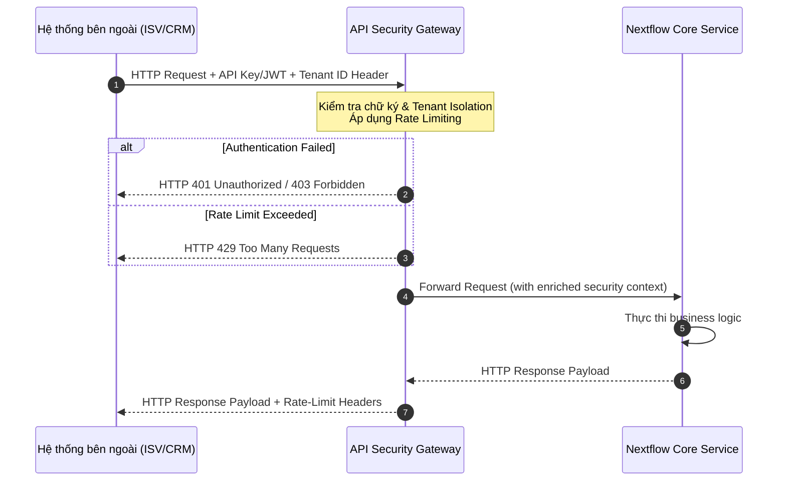

# Nextflow OS – API Reference and Connector Development Specification

**Document ID:** 85_PACK05_API_REFERENCE_AND_CONNECTOR_DEVELOPMENT_SPEC  
**Pack:** 05 — Integration and Extensibility  
**Version:** 1.0  
**Status:** Draft v1  
**Primary Owner:** Platform & Integration Architecture / Core Engineering  
**Dependent Packs:** 02 Core Platform & Data, 04 Orchestration & Work Management, 06 Operations & Governance, 09 Ecosystem & Marketplace  
**Prerequisite Documents:** 77_PACK05_OVERVIEW_AND_STRATEGY, 78_PACK05_INTEGRATION_CAPABILITY_TAXONOMY_AND_USE_CASES, 81_PACK05_IDENTITY_AUTH_AND_TENANT_BOUNDARIES_FOR_INTEGRATION, 82_PACK05_DATA_MAPPING_AND_TRANSFORMATION_GUIDE, 83_PACK05_INTEGRATION_ERROR_HANDLING_RETRY_AND_RECONCILIATION_PATTERNS

---

## 1. Mục tiêu tài liệu

Tài liệu này là đặc tả kỹ thuật chi tiết (Technical Specification) cho **API Reference** và **Connector Development SDK** của Nextflow OS. Tài liệu này chuyển đổi các nguyên lý kiến trúc tích hợp ở các doc 77-84 thành các chỉ dẫn kỹ thuật cụ thể:
* Chi tiết các cơ chế bảo mật và xác thực (Authentication/Authorization) tại cổng API Gateway.
* Cung cấp danh mục các endpoints cốt lõi cho việc đồng bộ dữ liệu, quản lý công việc (Work Items), định tuyến (Queue & Routing) và đồng bộ người dùng.
* Định nghĩa cấu trúc JSON schema mẫu của các API request/response.
* Thiết lập khung phát triển đầu kết nối tùy chỉnh (Connector SDK) và cung cấp mã nguồn mẫu tích hợp với hệ thống bên ngoài (CRM HubSpot).
* Xác định quy chuẩn xử lý mã lỗi HTTP, cơ chế kiểm soát lưu lượng (Rate Limiting) và chiến lược tự động phục hồi lỗi.

---

## 2. Khung xác thực và Bảo mật (Auth & Security Gateway)

Tất cả các cuộc gọi API từ bên ngoài vào Nextflow OS đều phải đi qua lớp **API Gateway Security Layer** để kiểm tra tính hợp lệ, định danh tenant và thực thi chính sách phân quyền.



### 2.1 Các cơ chế xác thực hỗ trợ

API Gateway của Nextflow OS hỗ trợ hai cơ chế xác thực chính:
1. **API Key Authentication (Dành cho Tích hợp Đơn lẻ - Single Tenant Connectors):**
   * Sử dụng mã khóa API duy nhất được tạo ra từ Admin Console cho mỗi Tenant.
   * Key này được truyền qua HTTP Header dưới dạng: `X-Nextflow-API-Key: nf_live_xxxxxxxxx`.
2. **OAuth 2.0 Client Credentials Flow (Dành cho Ứng dụng Marketplace - Multi-Tenant Apps):**
   * Phù hợp cho các nhà phát triển bên thứ ba (Pack 09) phát triển ứng dụng dùng chung cho nhiều khách hàng.
   * Ứng dụng gửi `client_id` và `client_secret` đến endpoint `/oauth/token` để nhận Access Token (JWT) thời hạn ngắn (1 giờ).
   * JWT này được truyền qua header: `Authorization: Bearer <JWT_TOKEN>`.

### 2.2 Quy tắc Header bắt buộc

Mọi yêu cầu API đều phải đính kèm các HTTP Headers sau:

| Header Name | Type | Description | Example |
| :--- | :--- | :--- | :--- |
| `Content-Type` | String | Định dạng payload dữ liệu gửi đi. Bắt buộc là `application/json`. | `application/json` |
| `X-Nextflow-Tenant-ID` | UUID | Định danh duy nhất của Tenant thực thi. Dùng để cách ly dữ liệu tuyệt đối (Tenant Isolation). | `d290f1ee-6c54-4b01-90e6-d701748f0851` |
| `X-Nextflow-API-Key` | String | Khóa bảo mật (nếu dùng cơ chế API Key). | `nf_live_a1b2c3d4e5f6g7h8` |
| `Authorization` | String | Mã Bearer Token (nếu dùng cơ chế OAuth 2.0). | `Bearer eyJhbGciOiJIUzI1Ni...` |

---

## 3. Core API Endpoint Catalog

Dưới đây là đặc tả chi tiết các APIs quan trọng nhất hỗ trợ việc giao tiếp, quản lý công việc và đồng bộ hệ thống.

### 3.1 Work Items API (Quản lý Công việc)

Dùng để tạo mới, truy vấn hoặc thay đổi trạng thái của các đơn vị công việc (Work Items/Tasks/Cases).

#### 3.1.1 POST /api/v1/work-items (Tạo mới Work Item)
* **Method:** `POST`
* **Content-Type:** `application/json`
* **Request Payload Schema:**
```json
{
  "title": "Xử lý hồ sơ hoàn thuế khách hàng VIP",
  "description": "Yêu cầu kiểm tra hồ sơ và phê duyệt hoàn thuế quý 2 cho Công ty A.",
  "priority": "HIGH",
  "due_date": "2026-07-10T17:00:00Z",
  "category": "FINANCE",
  "source": "HUBSPOT_CONNECTOR",
  "external_id": "hs_deal_99812",
  "metadata": {
    "deal_value": "500000000",
    "customer_tier": "DIAMOND"
  }
}
```
* **Response Payload (HTTP 201 Created):**
```json
{
  "id": "8f3b2a1a-4c54-4b01-90e6-d701748f0851",
  "title": "Xử lý hồ sơ hoàn thuế khách hàng VIP",
  "status": "UNASSIGNED",
  "priority": "HIGH",
  "created_at": "2026-07-03T11:50:00Z",
  "due_date": "2026-07-10T17:00:00Z",
  "sla_status": "WITHIN_SLA",
  "version": 1
}
```

#### 3.1.2 PATCH /api/v1/work-items/{id}/status (Cập nhật Trạng thái Work Item)
* **Method:** `PATCH`
* **Content-Type:** `application/json`
* **Request Payload Schema:**
```json
{
  "status": "IN_PROGRESS",
  "reason": "Bắt đầu kiểm tra chứng từ liên quan",
  "user_id": "u_9921-2291-11a2"
}
```
* **Response Payload (HTTP 200 OK):**
```json
{
  "id": "8f3b2a1a-4c54-4b01-90e6-d701748f0851",
  "status": "IN_PROGRESS",
  "updated_at": "2026-07-03T11:55:00Z",
  "version": 2
}
```

---

### 3.2 Queue & Routing API (Quản lý Hàng đợi & Định tuyến)

Dùng để cấu hình luồng phân phối công việc tự động hoặc chuyển tiếp thủ công sang các hàng đợi (Queues) thích hợp.

#### 3.2.1 GET /api/v1/queues/{id}/members (Lấy danh sách thành viên hàng đợi)
* **Method:** `GET`
* **Response Payload (HTTP 200 OK):**
```json
{
  "queue_id": "q_finance_ops_01",
  "name": "Hàng đợi Tài chính - Kế toán",
  "members": [
    {
      "user_id": "u_9921-2291-11a2",
      "name": "Nguyễn Văn A",
      "role": "SME_OPS",
      "capacity_status": "AVAILABLE"
    },
    {
      "user_id": "u_1122-3344-55bb",
      "name": "Trần Thị B",
      "role": "SME_OPS",
      "capacity_status": "BUSY"
    }
  ]
}
```

#### 3.2.2 POST /api/v1/work-items/{id}/route (Định tuyến thủ công Work Item)
* **Method:** `POST`
* **Request Payload Schema:**
```json
{
  "target_queue_id": "q_finance_ops_01",
  "assignee_id": "u_9921-2291-11a2",
  "note": "Hồ sơ VIP, bàn giao gấp cho trưởng phòng tài chính xử lý"
}
```
* **Response Payload (HTTP 200 OK):**
```json
{
  "work_item_id": "8f3b2a1a-4c54-4b01-90e6-d701748f0851",
  "routed_to_queue": "q_finance_ops_01",
  "assigned_to": "u_9921-2291-11a2",
  "routed_at": "2026-07-03T11:58:00Z"
}
```

---

### 3.3 Tenant & Identity Sync API (Đồng bộ Danh tính)

Dùng để đồng bộ hóa tài khoản nhân viên từ hệ thống quản lý danh tính ngoài (như Microsoft Entra ID hoặc Okta) sang Nextflow OS.

#### 3.3.1 POST /api/v1/tenants/{tenant_id}/users/sync (Đồng bộ người dùng)
* **Method:** `POST`
* **Request Payload Schema:**
```json
{
  "users": [
    {
      "email": "le.van.c@smecompany.com",
      "first_name": "Lê Văn",
      "last_name": "C",
      "role": "SME_OPS",
      "status": "ACTIVE",
      "metadata": {
        "department": "Sales",
        "employee_id": "EMP8899"
      }
    }
  ]
}
```
* **Response Payload (HTTP 207 Multi-Status):**
```json
{
  "success_count": 1,
  "failed_count": 0,
  "results": [
    {
      "email": "le.van.c@smecompany.com",
      "status": "SYNCED",
      "user_id": "u_c889-1122-33cc"
    }
  ]
}
```

---

## 4. Connector Development Framework & SDK Rules

Nextflow OS cung cấp một **Connector SDK** chuẩn hóa để các lập trình viên của doanh nghiệp hoặc bên thứ ba xây dựng các đầu kết nối mở rộng (Extensions). 

### 4.1 Quy tắc xây dựng một Connector class chuẩn

Mọi Connector đều phải kế thừa từ lớp cơ sở `BaseConnector` của SDK và cài đặt (implement) các hàm giao tiếp bắt buộc:

```typescript
export abstract class BaseConnector {
  protected tenantId: string;
  protected config: Record<string, any>;

  constructor(tenantId: string, config: Record<string, any>) {
    this.tenantId = tenantId;
    this.config = config;
  }

  // Khởi động kết nối
  abstract initialize(): Promise<void>;
  
  // Xác thực kết nối
  abstract validateCredentials(): Promise<boolean>;

  // Đóng kết nối sạch sẽ khi shutdown
  abstract shutdown(): Promise<void>;
}
```

---

### 4.2 Mã nguồn mẫu: Custom Connector tích hợp HubSpot CRM

Dưới đây là một module Connector hoàn chỉnh viết bằng TypeScript. Connector này có nhiệm vụ lắng nghe các cập nhật Deal từ HubSpot CRM, ánh xạ và tự động tạo ra một `Work Item` tương ứng trong Nextflow OS khi Deal đạt trạng thái "Won".

```typescript
import { BaseConnector } from '@nextflow-os/sdk';
import axios from 'axios';

interface HubSpotConfig {
  accessToken: string;
  nextflowApiUrl: string;
  nextflowApiKey: string;
}

export class HubSpotCRMConnector extends BaseConnector {
  private httpClient: any;

  constructor(tenantId: string, config: HubSpotConfig) {
    super(tenantId, config);
  }

  // 1. Khởi tạo Connector
  public async initialize(): Promise<void> {
    this.httpClient = axios.create({
      baseURL: this.config.nextflowApiUrl,
      headers: {
        'Content-Type': 'application/json',
        'X-Nextflow-Tenant-ID': this.tenantId,
        'X-Nextflow-API-Key': this.config.nextflowApiKey
      }
    });
    console.log(`[HubSpot Connector] Initialized for Tenant: ${this.tenantId}`);
  }

  // 2. Kiểm tra tính hợp lệ của Token
  public async validateCredentials(): Promise<boolean> {
    try {
      const response = await axios.get('https://api.hubapi.com/crm/v3/objects/deals', {
        headers: {
          'Authorization': `Bearer ${this.config.accessToken}`
        },
        params: { limit: 1 }
      });
      return response.status === 200;
    } catch (error) {
      console.error('[HubSpot Connector] Validation failed:', error);
      return false;
    }
  }

  // 3. Hàm xử lý Webhook nhận event từ HubSpot gửi tới
  public async handleWebhookEvent(payload: any): Promise<void> {
    try {
      const { objectId, propertyName, propertyValue } = payload;
      
      // Chỉ xử lý khi Deal được cập nhật sang giai đoạn "closedwon"
      if (propertyName === 'dealstage' && propertyValue === 'closedwon') {
        console.log(`[HubSpot Connector] Deal ${objectId} won. Fetching deal details...`);
        
        // Lấy chi tiết thông tin deal từ HubSpot API
        const dealResponse = await axios.get(`https://api.hubapi.com/crm/v3/objects/deals/${objectId}`, {
          headers: { 'Authorization': `Bearer ${this.config.accessToken}` },
          params: { properties: 'dealname,amount,dealstage,description' }
        });

        const dealData = dealResponse.data.properties;

        // Ánh xạ (Map) dữ liệu từ HubSpot sang Canonical Model của Nextflow (Pack 05 - Doc 82)
        const workItemPayload = {
          title: `Hồ sơ triển khai dịch vụ: ${dealData.dealname}`,
          description: dealData.description || `Hồ sơ tự động tạo từ HubSpot Deal ID: ${objectId}`,
          priority: this.mapAmountToPriority(parseFloat(dealData.amount)),
          due_date: new Date(Date.now() + 7 * 24 * 60 * 60 * 1000).toISOString(), // Hạn chót mặc định 7 ngày
          category: "SALES_OPERATIONS",
          source: "HUBSPOT_CONNECTOR",
          external_id: `hubspot_deal_${objectId}`,
          metadata: {
            deal_amount: dealData.amount,
            hubspot_object_id: objectId
          }
        };

        // Gửi yêu cầu tạo Work Item sang Nextflow Core API
        const nfResponse = await this.httpClient.post('/api/v1/work-items', workItemPayload);
        console.log(`[HubSpot Connector] Created Work Item successfully: ID ${nfResponse.data.id}`);
      }
    } catch (error: any) {
      console.error('[HubSpot Connector] Error processing HubSpot event:', error.message);
      throw error; // Ném lỗi để hệ thống quản trị Gateway ghi nhận và kích hoạt retry
    }
  }

  // Thuật toán ánh xạ độ ưu tiên dựa trên giá trị hợp đồng
  private mapAmountToPriority(amount: number): 'LOW' | 'MEDIUM' | 'HIGH' {
    if (isNaN(amount) || amount < 10000) return 'LOW';
    if (amount >= 10000 && amount < 50000) return 'MEDIUM';
    return 'HIGH';
  }

  // 4. Shutdown
  public async shutdown(): Promise<void> {
    console.log(`[HubSpot Connector] Shutdown completed for Tenant: ${this.tenantId}`);
  }
}
```

---

## 5. Xử lý sự cố và Cơ chế Retry (Error Handling & Rate Limits)

### 5.1 Định dạng phản hồi lỗi (Error Response Schema)

Mọi phản hồi lỗi từ API Gateway hoặc Core Service của Nextflow OS đều phải tuân theo cấu trúc JSON nhất quán để Connector có thể phân tích chương trình (programmatic parsing).

```json
{
  "error": {
    "code": "VALIDATION_FAILED",
    "message": "Trường due_date không thể là thời gian trong quá khứ.",
    "timestamp": "2026-07-03T11:59:00Z",
    "details": [
      {
        "field": "due_date",
        "issue": "must_be_future_date"
      }
    ]
  }
}
```

#### Các mã lỗi chuẩn (Standard Error Codes)

| Error Code | HTTP Status | Description |
| :--- | :--- | :--- |
| `UNAUTHORIZED` | 401 | API Key hoặc JWT Token không hợp lệ hoặc đã hết hạn. |
| `FORBIDDEN` | 403 | IP bị chặn, hoặc Tenant không có quyền truy cập endpoint này. |
| `NOT_FOUND` | 404 | Không tìm thấy ID của tài nguyên (Work item, Queue, User...). |
| `VALIDATION_FAILED`| 422 | Cú pháp JSON hợp lệ nhưng không thỏa mãn luật logic nghiệp vụ. |
| `TOO_MANY_REQUESTS`| 429 | Vượt quá giới hạn Rate Limit cấp cho API Key. |
| `SYSTEM_FAULT` | 500 | Lỗi máy chủ Nextflow. Hệ thống tự phục hồi sẽ ghi nhận sự cố. |

---

### 5.2 Kiểm soát lưu lượng (Rate Limiting)

Nextflow OS áp dụng thuật toán **Token Bucket** để kiểm soát lưu lượng API nhằm bảo vệ hệ thống khỏi các hành vi spam hoặc lỗi loop vô hạn từ code của đối tác.

* **Giới hạn tiêu chuẩn (Standard Tier):** 100 requests / phút, với dung lượng bucket cho phép bùng nổ đột ngột (Burst limit) là 150 requests.
* **Mỗi phản hồi API đều chứa các headers hỗ trợ sau:**

```http
X-RateLimit-Limit: 100
X-RateLimit-Remaining: 94
X-RateLimit-Reset: 1470123000
```

Khi chạm giới hạn, hệ thống trả về mã **HTTP 429 Too Many Requests** kèm theo header `Retry-After: 30` (số giây cần đợi trước khi gọi lại API).

---

### 5.3 Cơ chế Tự động Phục hồi lỗi (Automatic Retry Strategy)

Khi Connector SDK gọi API Nextflow và nhận về các mã lỗi sau:
* **HTTP 429** (Rate limited)
* **HTTP 502/503/504** (Transient Server Errors)

SDK sẽ tự động kích hoạt thuật toán **Exponential Backoff with Jitter** (Lùi thời gian lũy thừa kết hợp nhiễu ngẫu nhiên) để thử gọi lại API, tránh dồn ứ request đồng thời làm sập server.

$$\text{Delay} = \min(\text{max\_delay}, \; \text{base\_delay} \times 2^{\text{attempt}}) + \text{jitter}$$

* **Cấu hình khuyên dùng:**
  * `base_delay`: 1.5 giây.
  * `max_delay`: 60 giây.
  * `max_attempts`: 5 lần thử lại.
  * `jitter`: Số ngẫu nhiên từ $-500\text{ms}$ đến $+500\text{ms}$.

Nếu sau 5 lần thử lại vẫn thất bại, lỗi sẽ được chuyển thành **Permanent Failure** và được đẩy vào Queue xử lý ngoại lệ tích hợp (Integration Exception Queue) để kỹ thuật viên can thiệp thủ công theo quy trình định nghĩa trong Pack 05 - Doc 83.
