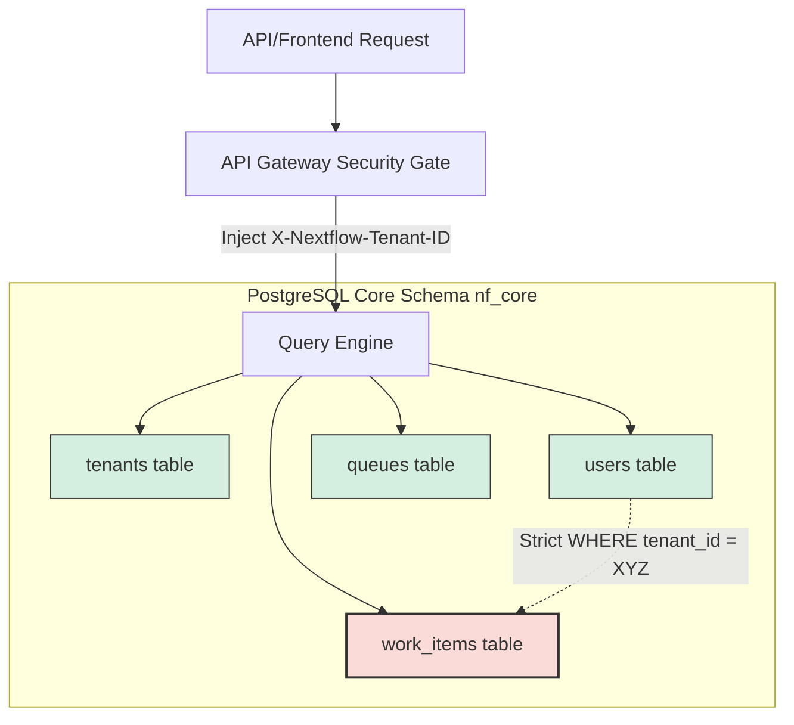

# Nextflow OS – Core Database Schema and DDL Specification

**Document ID:** 16_PACK02_CORE_DATABASE_SCHEMA_AND_DDL  
**Pack:** 02 — Product & Capability  
**Version:** 1.0  
**Status:** Draft v1  
**Primary Owner:** Platform Architecture / Lead Database Engineer  
**Dependent Packs:** 02 Core Platform & Data, 04 Orchestration & Work Management, 05 Integration & Extensibility, 06 Operations & Governance, 07 Data, Analytics & Insights  
**Prerequisite Documents:** 10_PRODUCT_OVERVIEW, 11_CAPABILITY_MAP, 12_ENGINE_BOUNDARY_SPECIFICATION, 13_FIRST_WEDGE_CAPABILITY_SLICE

---

## 1. Mục tiêu tài liệu

Tài liệu này định nghĩa **Đặc tả Cơ sở dữ liệu Vận hành Cốt lõi (Core Transactional Database Schema & DDL Specification)** của Nextflow OS. Tài liệu này đóng vai trò:
* Cung cấp các lệnh SQL DDL (Data Definition Language) chính thức để khởi tạo cơ sở dữ liệu vận hành thời gian thực (OLTP DB).
* Lựa chọn công nghệ lưu trữ mục tiêu là **PostgreSQL** để tận dụng thế mạnh về toàn vẹn dữ liệu (ACID Compliance), hỗ trợ dữ liệu nửa cấu trúc (JSONB) và hiệu năng xử lý tác vụ đồng thời cao.
* Định nghĩa các bảng dữ liệu gốc (Runtime tables) quản lý: Tenant, User, Role, Queue, Work Item (Task), Exception và Integration Config.
* Thiết lập các ràng buộc toàn vẹn dữ liệu khóa ngoại (Foreign Keys), ràng buộc nghiệp vụ (Check Constraints) và cơ chế tự động điền thời gian (`triggers` cho `updated_at`).
* Xây dựng chiến lược lập chỉ mục (Indexing Strategy) tối ưu hóa cho các thao tác cập nhật và đọc dữ liệu thời gian thực có độ trễ dưới 10ms.
* Đặc tả cơ chế mã hóa bảo mật (Encryption) cho các thông tin nhạy cảm (như mật khẩu người dùng, thông tin credentials của connector).

---

## 2. Thiết kế Kiến trúc Dữ liệu & Quy tắc Multi-Tenancy

Nextflow OS sử dụng mô hình cơ sở dữ liệu **Shared Database, Shared Schema (Multi-tenancy qua Tenant ID)** để tối ưu hóa chi phí vận hành cho SMEs, đồng thời đảm bảo cách ly dữ liệu tuyệt đối ở tầng logic.



### Quy tắc Cách ly Dữ liệu (Isolation Rules)
1. **Tenant ID Validation:** Mọi bảng dữ liệu liên quan đến nghiệp vụ (ngoại trừ bảng hệ thống dùng chung) bắt buộc phải có cột `tenant_id UUID`.
2. **Row-Level Security (RLS) or Strict Filtering:** Mọi câu lệnh SQL truy vấn hoặc cập nhật từ ứng dụng bắt buộc phải chứa điều kiện `WHERE tenant_id = <CURRENT_TENANT_ID>`.
3. **Cascading Deletes:** Khi một Tenant bị xóa hoặc khóa tài khoản, toàn bộ dữ liệu người dùng, nhiệm vụ, hàng đợi liên quan phải được xóa sạch tự động hoặc khóa truy cập qua ràng buộc khóa ngoại `ON DELETE CASCADE`.

---

## 3. PostgreSQL Core DDL Scripts (Runtime Database)

Cơ sở dữ liệu Core Runtime được chạy dưới schema `nf_core` độc lập để phân biệt với schema báo cáo phân tích.

```sql
-- Khởi tạo schema vận hành cốt lõi
CREATE SCHEMA IF NOT EXISTS nf_core;

-- Tự động cập nhật cột updated_at khi có cập nhật bản ghi
CREATE OR REPLACE FUNCTION nf_core.update_modified_column()
RETURNS TRIGGER AS $$
BEGIN
    NEW.updated_at = CURRENT_TIMESTAMP;
    RETURN NEW;
END;
$$ LANGUAGE plpgsql;

-- =========================================================================
-- 3.1 BẢNG DOANH NGHIỆP (TENANTS TABLE)
-- =========================================================================

CREATE TABLE nf_core.tenants (
    id UUID PRIMARY KEY DEFAULT gen_random_uuid(),
    company_name VARCHAR(255) NOT NULL,
    domain VARCHAR(100) UNIQUE NOT NULL,
    status VARCHAR(30) NOT NULL DEFAULT 'ACTIVE',
    subscription_tier VARCHAR(50) NOT NULL DEFAULT 'STANDARD',
    created_at TIMESTAMP WITH TIME ZONE DEFAULT CURRENT_TIMESTAMP,
    updated_at TIMESTAMP WITH TIME ZONE DEFAULT CURRENT_TIMESTAMP,
    CONSTRAINT chk_tenant_status CHECK (status IN ('ACTIVE', 'SUSPENDED', 'DEACTIVATED')),
    CONSTRAINT chk_tenant_tier CHECK (subscription_tier IN ('FREE', 'STANDARD', 'ENTERPRISE'))
);

CREATE TRIGGER update_tenants_modtime 
    BEFORE UPDATE ON nf_core.tenants 
    FOR EACH ROW EXECUTE FUNCTION nf_core.update_modified_column();

-- =========================================================================
-- 3.2 BẢNG NGƯỜI DÙNG (USERS TABLE)
-- =========================================================================

CREATE TABLE nf_core.users (
    id UUID PRIMARY KEY DEFAULT gen_random_uuid(),
    tenant_id UUID NOT NULL,
    email VARCHAR(255) NOT NULL,
    password_hash VARCHAR(255) NOT NULL, -- bcrypt hoặc argon2 hash
    first_name VARCHAR(100) NOT NULL,
    last_name VARCHAR(100) NOT NULL,
    role VARCHAR(50) NOT NULL DEFAULT 'SME_OPS',
    is_active BOOLEAN DEFAULT TRUE,
    created_at TIMESTAMP WITH TIME ZONE DEFAULT CURRENT_TIMESTAMP,
    updated_at TIMESTAMP WITH TIME ZONE DEFAULT CURRENT_TIMESTAMP,
    FOREIGN KEY (tenant_id) REFERENCES nf_core.tenants(id) ON DELETE CASCADE,
    CONSTRAINT uniq_email_per_tenant UNIQUE (tenant_id, email),
    CONSTRAINT chk_user_role CHECK (role IN ('SME_LEADER', 'SME_SUPERVISOR', 'SME_OPS', 'FIELD_WORKER'))
);

CREATE TRIGGER update_users_modtime 
    BEFORE UPDATE ON nf_core.users 
    FOR EACH ROW EXECUTE FUNCTION nf_core.update_modified_column();

-- =========================================================================
-- 3.3 BẢNG HÀNG ĐỢI CÔNG VIỆC (QUEUES TABLE)
-- =========================================================================

CREATE TABLE nf_core.queues (
    id VARCHAR(100) PRIMARY KEY, -- Định danh text dễ đọc, ví dụ: q_finance_ops
    tenant_id UUID NOT NULL,
    name VARCHAR(255) NOT NULL,
    category VARCHAR(100) NOT NULL,
    routing_algorithm VARCHAR(50) NOT NULL DEFAULT 'FIFO',
    sla_target_seconds INTEGER NOT NULL DEFAULT 3600,
    created_at TIMESTAMP WITH TIME ZONE DEFAULT CURRENT_TIMESTAMP,
    updated_at TIMESTAMP WITH TIME ZONE DEFAULT CURRENT_TIMESTAMP,
    FOREIGN KEY (tenant_id) REFERENCES nf_core.tenants(id) ON DELETE CASCADE,
    CONSTRAINT chk_routing CHECK (routing_algorithm IN ('FIFO', 'ROUND_ROBIN', 'CAPACITY_BASED')),
    CONSTRAINT chk_sla_seconds CHECK (sla_target_seconds > 0)
);

CREATE TRIGGER update_queues_modtime 
    BEFORE UPDATE ON nf_core.queues 
    FOR EACH ROW EXECUTE FUNCTION nf_core.update_modified_column();

-- Bảng quan hệ Nhiều-Nhiều giữa Users và Queues (Thành viên hàng đợi)
CREATE TABLE nf_core.queue_members (
    queue_id VARCHAR(100) NOT NULL,
    user_id UUID NOT NULL,
    joined_at TIMESTAMP WITH TIME ZONE DEFAULT CURRENT_TIMESTAMP,
    PRIMARY KEY (queue_id, user_id),
    FOREIGN KEY (queue_id) REFERENCES nf_core.queues(id) ON DELETE CASCADE,
    FOREIGN KEY (user_id) REFERENCES nf_core.users(id) ON DELETE CASCADE
);

-- =========================================================================
-- 3.4 BẢNG NHIỆM VỤ (WORK ITEMS TABLE)
-- =========================================================================

CREATE TABLE nf_core.work_items (
    id UUID PRIMARY KEY DEFAULT gen_random_uuid(),
    tenant_id UUID NOT NULL,
    queue_id VARCHAR(100),
    title VARCHAR(255) NOT NULL,
    description TEXT,
    priority VARCHAR(20) NOT NULL DEFAULT 'MEDIUM',
    status VARCHAR(50) NOT NULL DEFAULT 'UNASSIGNED',
    category VARCHAR(100),
    
    creator_id UUID,
    assignee_id UUID,
    
    external_id VARCHAR(100), -- ID tham chiếu từ hệ thống ngoài (ví dụ HubSpot Deal ID)
    source VARCHAR(50) NOT NULL DEFAULT 'MANUAL', -- Nguồn tạo (MANUAL, HUBSPOT_CONNECTOR...)
    
    metadata JSONB DEFAULT '{}'::jsonb, -- Lưu trữ dữ liệu tùy biến bán cấu trúc
    
    due_at TIMESTAMP WITH TIME ZONE,
    started_at TIMESTAMP WITH TIME ZONE,
    completed_at TIMESTAMP WITH TIME ZONE,
    created_at TIMESTAMP WITH TIME ZONE DEFAULT CURRENT_TIMESTAMP,
    updated_at TIMESTAMP WITH TIME ZONE DEFAULT CURRENT_TIMESTAMP,
    
    version INTEGER NOT NULL DEFAULT 1, -- Hỗ trợ Optimistic Locking tránh xung đột đồng thời
    
    FOREIGN KEY (tenant_id) REFERENCES nf_core.tenants(id) ON DELETE CASCADE,
    FOREIGN KEY (queue_id) REFERENCES nf_core.queues(id) ON DELETE SET NULL,
    FOREIGN KEY (creator_id) REFERENCES nf_core.users(id) ON DELETE SET NULL,
    FOREIGN KEY (assignee_id) REFERENCES nf_core.users(id) ON DELETE SET NULL,
    CONSTRAINT chk_item_priority CHECK (priority IN ('LOW', 'MEDIUM', 'HIGH', 'CRITICAL')),
    CONSTRAINT chk_item_status CHECK (status IN ('UNASSIGNED', 'IN_PROGRESS', 'SUSPENDED', 'COMPLETED', 'CANCELLED'))
);

CREATE TRIGGER update_work_items_modtime 
    BEFORE UPDATE ON nf_core.work_items 
    FOR EACH ROW EXECUTE FUNCTION nf_core.update_modified_column();

-- =========================================================================
-- 3.5 BẢNG QUẢN LÝ NGOẠI LỆ (TASK EXCEPTIONS TABLE)
-- =========================================================================

CREATE TABLE nf_core.task_exceptions (
    id UUID PRIMARY KEY DEFAULT gen_random_uuid(),
    tenant_id UUID NOT NULL,
    work_item_id UUID NOT NULL,
    exception_type VARCHAR(100) NOT NULL,
    reason TEXT NOT NULL,
    status VARCHAR(50) NOT NULL DEFAULT 'PENDING',
    
    escalated_to_user_id UUID,
    resolved_by_user_id UUID,
    
    resolved_at TIMESTAMP WITH TIME ZONE,
    created_at TIMESTAMP WITH TIME ZONE DEFAULT CURRENT_TIMESTAMP,
    updated_at TIMESTAMP WITH TIME ZONE DEFAULT CURRENT_TIMESTAMP,
    
    FOREIGN KEY (tenant_id) REFERENCES nf_core.tenants(id) ON DELETE CASCADE,
    FOREIGN KEY (work_item_id) REFERENCES nf_core.work_items(id) ON DELETE CASCADE,
    FOREIGN KEY (escalated_to_user_id) REFERENCES nf_core.users(id) ON DELETE SET NULL,
    FOREIGN KEY (resolved_by_user_id) REFERENCES nf_core.users(id) ON DELETE SET NULL,
    CONSTRAINT chk_exception_status CHECK (status IN ('PENDING', 'APPROVED', 'REJECTED', 'RESOLVED'))
);

CREATE TRIGGER update_exceptions_modtime 
    BEFORE UPDATE ON nf_core.task_exceptions 
    FOR EACH ROW EXECUTE FUNCTION nf_core.update_modified_column();

-- =========================================================================
-- 3.6 BẢNG CẤU HÌNH TÍCH HỢP (CONNECTOR CONFIGURATIONS TABLE)
-- =========================================================================

CREATE TABLE nf_core.connector_configurations (
    id UUID PRIMARY KEY DEFAULT gen_random_uuid(),
    tenant_id UUID NOT NULL,
    connector_name VARCHAR(100) NOT NULL,
    status VARCHAR(30) NOT NULL DEFAULT 'ACTIVE',
    encrypted_credentials TEXT NOT NULL, -- Thông tin API Key, Token được mã hóa AES-256
    settings JSONB DEFAULT '{}'::jsonb, -- Cấu hình mapping fields, filters
    last_run_at TIMESTAMP WITH TIME ZONE,
    created_at TIMESTAMP WITH TIME ZONE DEFAULT CURRENT_TIMESTAMP,
    updated_at TIMESTAMP WITH TIME ZONE DEFAULT CURRENT_TIMESTAMP,
    FOREIGN KEY (tenant_id) REFERENCES nf_core.tenants(id) ON DELETE CASCADE,
    CONSTRAINT uniq_connector_per_tenant UNIQUE (tenant_id, connector_name),
    CONSTRAINT chk_connector_status CHECK (status IN ('ACTIVE', 'INACTIVE', 'ERROR'))
);

CREATE TRIGGER update_connectors_modtime 
    BEFORE UPDATE ON nf_core.connector_configurations 
    FOR EACH ROW EXECUTE FUNCTION nf_core.update_modified_column();
```

---

## 4. Chiến lược đánh Chỉ mục vật lý (Operational Indexing Strategy)

Để hệ thống hoạt động ổn định ở quy mô lớn và đảm bảo các câu lệnh SQL phục vụ màn hình làm việc của nhân viên phản hồi dưới **10ms**, chúng ta cấu hình các Indexes chuyên biệt sau:

### 4.1 Index Phân vùng Tenant (Tenant Isolation Indexes)
Đảm bảo mọi câu lệnh lọc dữ liệu theo Tenant ID đều chạy quét qua chỉ mục Index thay vì quét toàn bộ bảng (Table Scan).
```sql
CREATE INDEX idx_users_tenant ON nf_core.users(tenant_id);
CREATE INDEX idx_queues_tenant ON nf_core.queues(tenant_id);
CREATE INDEX idx_work_items_tenant ON nf_core.work_items(tenant_id);
CREATE INDEX idx_exceptions_tenant ON nf_core.task_exceptions(tenant_id);
```

### 4.2 Index Phục vụ Hàng đợi và Định tuyến (Queue Routing Indexes)
Tối ưu hóa màn hình danh sách công việc đang chờ xử lý (`Queue Inbox View`).
```sql
-- Hỗ trợ truy vấn nhanh các công việc chưa gán của một Queue theo thứ tự ưu tiên và thời gian tạo (FIFO)
CREATE INDEX idx_work_items_queue_routing 
ON nf_core.work_items(tenant_id, queue_id, status, priority, created_at) 
WHERE status = 'UNASSIGNED';
```

### 4.3 Index Trạng thái và Người được gán (Assignee Task View Indexes)
Tối ưu hóa màn hình "My Active Tasks" của nhân viên.
```sql
-- Truy vấn nhanh các công việc đang xử lý của một nhân viên cụ thể
CREATE INDEX idx_work_items_active_assignee 
ON nf_core.work_items(tenant_id, assignee_id, status) 
WHERE status = 'IN_PROGRESS';
```

### 4.4 Index Tra cứu liên kết ngoài (External Ref Indexes)
Tối ưu hóa tốc độ kiểm tra trùng lặp (Idempotency) khi các Connectors (HubSpot/Xero) đẩy dữ liệu liên tục vào Nextflow.
```sql
-- Quét nhanh xem Deal/Hóa đơn ngoài đã được tạo Task trong Nextflow chưa
CREATE INDEX idx_work_items_external_ref 
ON nf_core.work_items(tenant_id, source, external_id) 
WHERE external_id IS NOT NULL;
```

---

## 5. Cơ chế Bảo mật Dữ liệu nhạy cảm (Security & Encryption)

### 5.1 Mã hóa mật khẩu người dùng (User Passwords)
* **Quy chuẩn:** Tuyệt đối không lưu mật khẩu dạng rõ (Plain text).
* **Thuật toán áp dụng:** **bcrypt** (với số vòng lặp `rounds = 12`) hoặc **Argon2id** để chống lại các cuộc tấn công Brute-force/Rainbow tables.

### 5.2 Mã hóa thông tin Credentials của đối tác
Cột `encrypted_credentials` trong bảng `connector_configurations` lưu trữ các mã nhạy cảm như HubSpot Access Tokens, Xero Private Keys.
* **Thuật toán áp dụng:** Mã hóa đối xứng **AES-256-GCM** (Advanced Encryption Standard in Galois/Counter Mode).
* **Quản lý khóa (Key Management):** Mã hóa được thực thi tại tầng ứng dụng (Application Layer). Khóa mã hóa chính (Master Encryption Key) được lưu trữ tại biến môi trường bảo mật của máy chủ hoặc các dịch vụ quản lý khóa ngoài (như AWS KMS hoặc Google Cloud KMS), không lưu trữ chung với Database.
